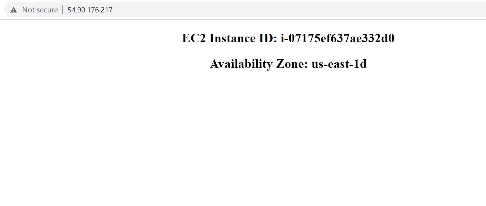

# AWS Cloud Practitioner - Laboratorio 01
### Objetivo: 
* Identificación de los componentes "User Data" y "Metadata"
* Identificación de caracteristicas en EC2

---

### A - Actividades Técnicas
<br>

1. **Lanzar** 01 Instancia EC2 Amazon Linux 2. La instancia se deberá configurar según la siguiente información:

* "Instance Type": t2.micro
* Generar una "Key Pair" tipo RSA en formato .pem
* "Network Settings": Por defecto (VPC Default) 
* Crear "Security Group" (Inbound Rules) lo detallado a continuación. 

    |Type Port|  Source  |
    |---------|----------|
    |   22    | IP Home  |
    |   80    | 0.0.0.0/0|
    
* Configure Storage: Por defecto

<br>

2. En la sección **"Advanced details - User Data"** agregar el siguiente código
<br><br>

```bash
#!/bin/bash
yum update -y
yum install -y httpd php
systemctl start httpd
systemctl enable httpd
usermod -a -G apache ec2-user
chown -R ec2-user:apache /var/www
chmod 2775 /var/www
find /var/www -type d -exec chmod 2775 {} \;
find /var/www -type f -exec chmod 0664 {} \;

# PHP script to display Instance ID and Availability Zone
cat << 'EOF' > /var/www/html/index.php
  <!DOCTYPE html>
  <html>
  <body>
    <center>
      <?php
      # Get the instance ID from meta-data and store it in the $instance_id variable
      $url = "http://169.254.169.254/latest/meta-data/instance-id";
      $instance_id = file_get_contents($url);
      # Get the instance's availability zone from metadata and store it in the $zone variable
      $url = "http://169.254.169.254/latest/meta-data/placement/availability-zone";
      $zone = file_get_contents($url);
      ?>
      <h2>EC2 Instance ID: <?php echo $instance_id ?></h2>
      <h2>Availability Zone: <?php echo $zone ?></h2>
    </center>
  </body>
  </html>
EOF
```

<br>

3. Acceder a la **IP Pública** de la instancia aprovisionada desde nuestro navegador web.
<br><br>



<br>

---
### B - Identificación de Componentes EC2
Revisando los servicios **EC2, EBS y VPC**: Diagramar la arquitectura de la solución. Agregar los siguientes datos solicitados a la arquitectura generada.

<br>

**1. EC2 - Details Section**

* Instance ID
* Instances State
* Instance Type
* Elastic IP address
* Auto-assigned IP address
* AMI ID
* Key Pair name

<br>

**2. EC2 - Security Section**

* IAM Role
* Security Group - Inbound Rules
* Security Group - Outbound Rules

<br>

**3. EC2 - Networking Section**

* Public IPv4 address
* Private IPv4 address
* Public IPv4 DNS
* Private IPv4 DNS
* VPC ID
* Subnet ID
* Availability Zone
* Interface ID 

<br>

**4. EC2 - Storage Section**

* Root device name
* Root device type
* Volume ID
* Volume Size (GiB)

<br>

**5. EBS - Volumes**

* Type
* IOPS
* Volume status
* Encryption
* Availability Zone

<br>

**6. VPC**

* IPv4 CIDR (VPC)
* IPv4 CIDR (Subnet)
* Availability Zone (Subnet)
* Routes (Route Tables)
* Internet Gateway (Internet Gateway)

