# AWS Cloud Practitioner - Laboratorio 02
### Objetivo: 
* Identificar el componente "Instances Status Checks"
* Crear Alarma de Status Check "Instances Status Checks"

---

### A - Actividades Técnicas
<br>

1. **Lanzar** 01 Instancia EC2 Ubuntu 18.04 LTS. La instancia se deberá configurar según la siguiente información:

* "Instance Type": t2.micro
* Generar una "Key Pair" tipo RSA en formato .pem
* "Network Settings": Por defecto (VPC Default) 
* Crear "Security Group" (Inbound Rules) lo detallado a continuación. 

    |Type Port|  Source  |
    |---------|----------|
    |   22    | IP Home  |
  
    
* Configure Storage: Por defecto

<br>

2. En la sección **"Advanced details - User Data"** agregar el siguiente código
<br><br>

```bash
#!/bin/bash
sudo su
cp /etc/netplan/50-cloud-init.yaml /etc/netplan/backup
echo "" > /etc/netplan/50-cloud-init.yaml
sleep 10
reboot
```

<br>

3. Esperar unos minutos mientras la instancia EC2 enciende y los "Status Checks" (System status checks y Instance Status checks) son inicializados. Tiempo promedio de espera: 3 minutos.

<br>

4. Validar que el estado del status check "Instance Status Checks" es "Instance reachability check failed"
<br><br>

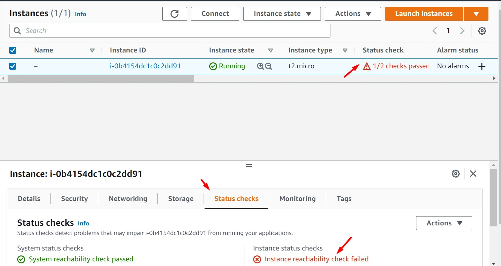

<br>

---
### B - Crear Alarma de Status Check "Instances Status Checks"

<br>

1. Creación del tópico SNS y subscripción de un email. Accedemos al servicio SNS, sección "Topic" y damos clic en el botón "Create Topic".
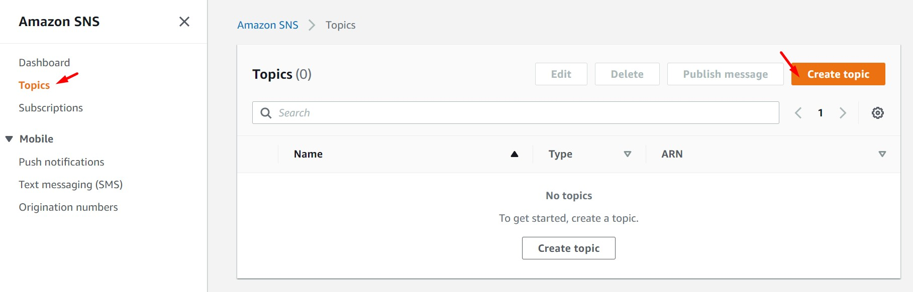

2. Seleccionamos el tipo de tópico SNS "Standard". Agregamos el nombre "personal_email" al tópico. Creamos el tópico.


3. Dentro del tópico creado, seleccionamos la opción "Subscription". Damos clic en el botón "Create subscription"
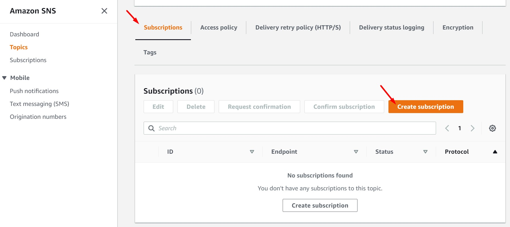

4. Seleccionamos el tipo "Email" e ingresamos el email a utilizar
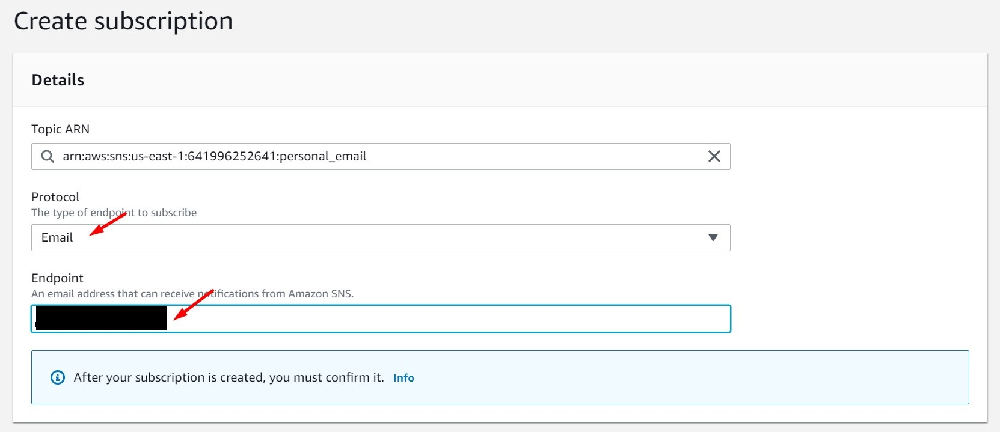

5. Nos dirigimos a nuestro email y confirmamos la subscripción
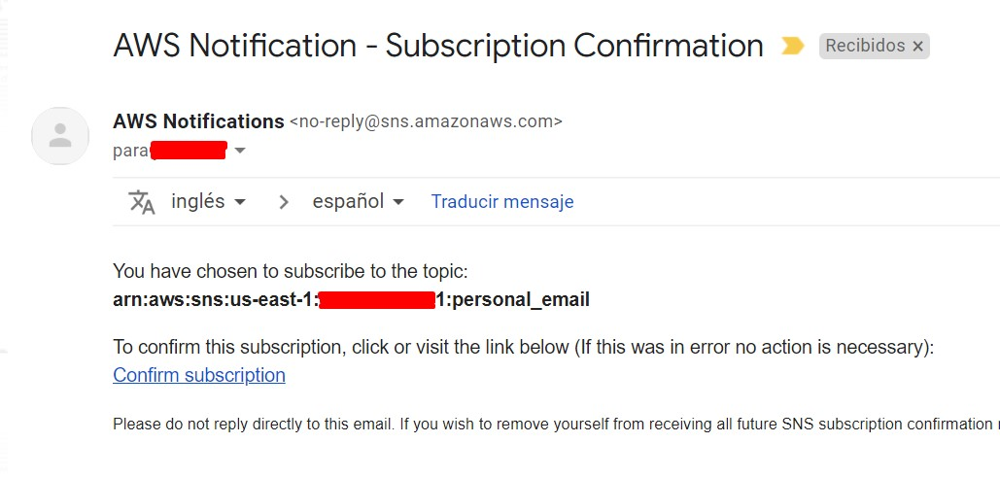

6. Accedemos nuevamente al tópico SNS creado previamente y nos dirigimos a la sección "Subscription". Deberemos validar que el estado de la subscripción sea "Confirmed".
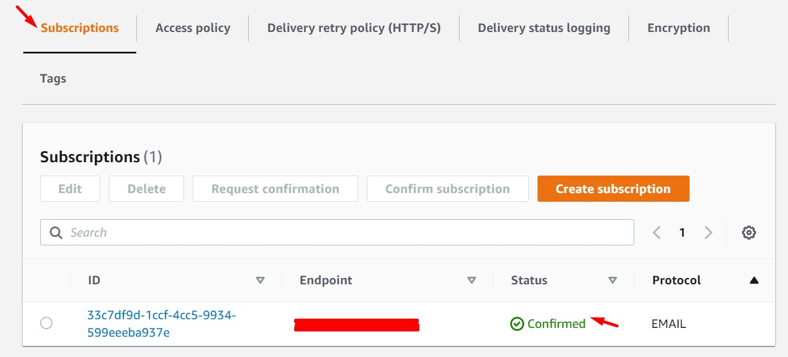


<br>

7. Creación de alarma "Instances Status Check" en CloudWatch Alarm. Ingresamos al servicio CloudWatch, opción "All alarms". Damos clic en el botón "Create alarm"
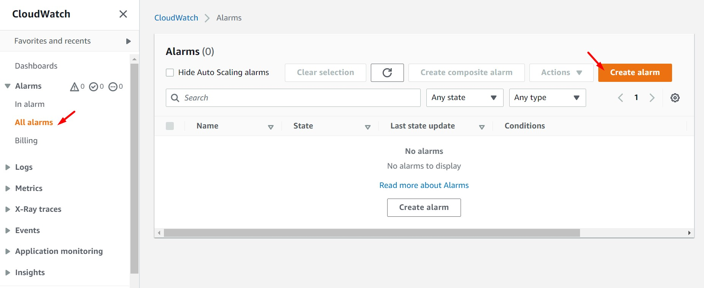

8. Damos clic en el boón "Select metric"
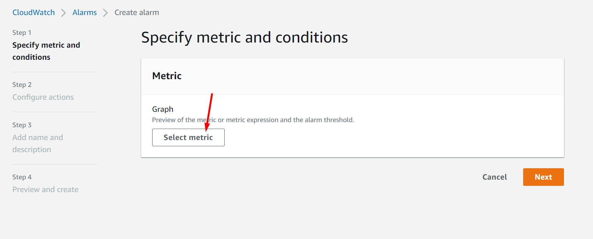

9. Seleccionamos la opción "EC2"
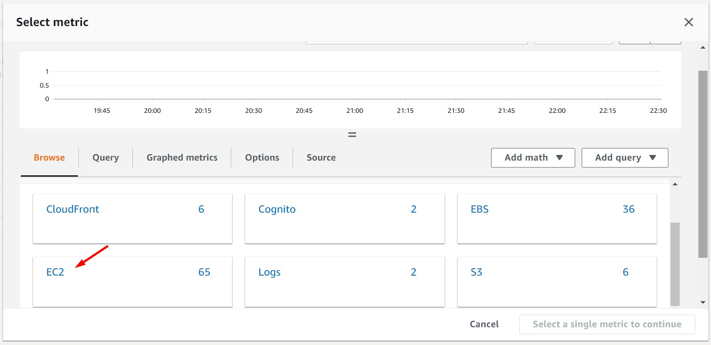

10. Seleccionamos la opción "Per-Instance Metrics"
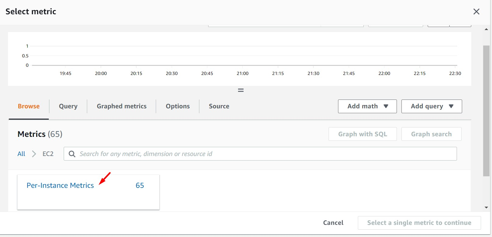

11. Ingresamos el ID de la Instancia creada en los primeros pasos. El ID tiene el formato "i-XXXXXX"
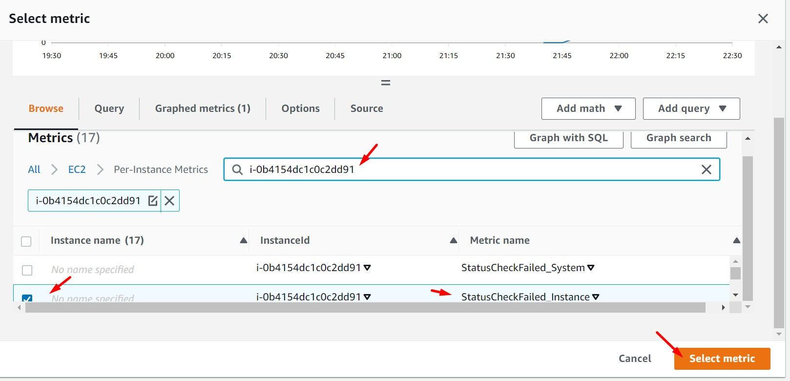

12. Validamos las opciones seleccionadas en la primera parte de este formulario
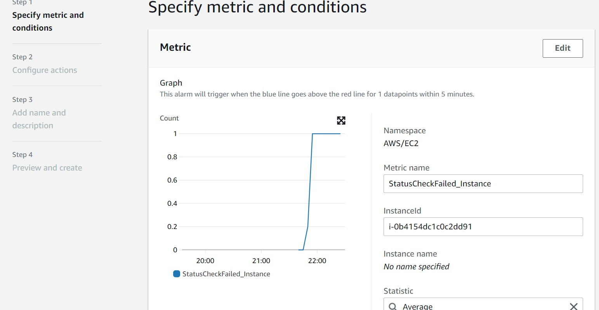

13. En la parte inferior del mismo formulario, seleccionamos las opciones "Static" y "Greater/Equal" e ingresamos el valor "1" en el campo "than"


14. Seleccionamos el tópico SNS creado anteriormente
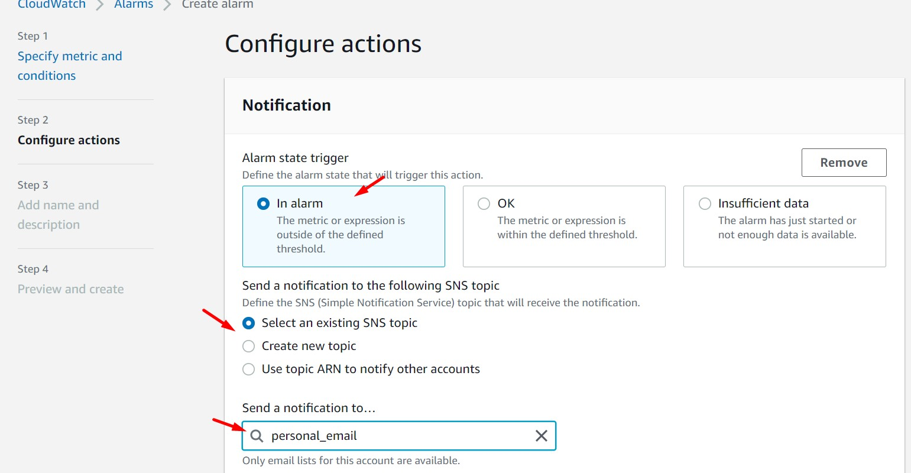

15. Ingresamos un nombre a nuestra alarma
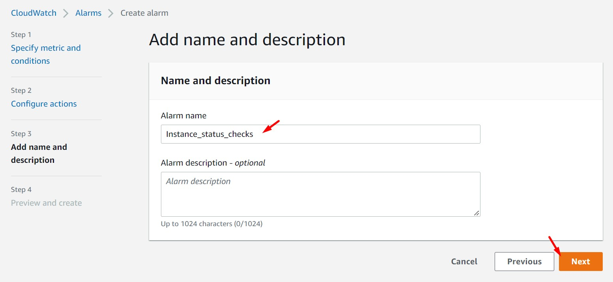

16. Damos clic en el botón "Create Alarm"
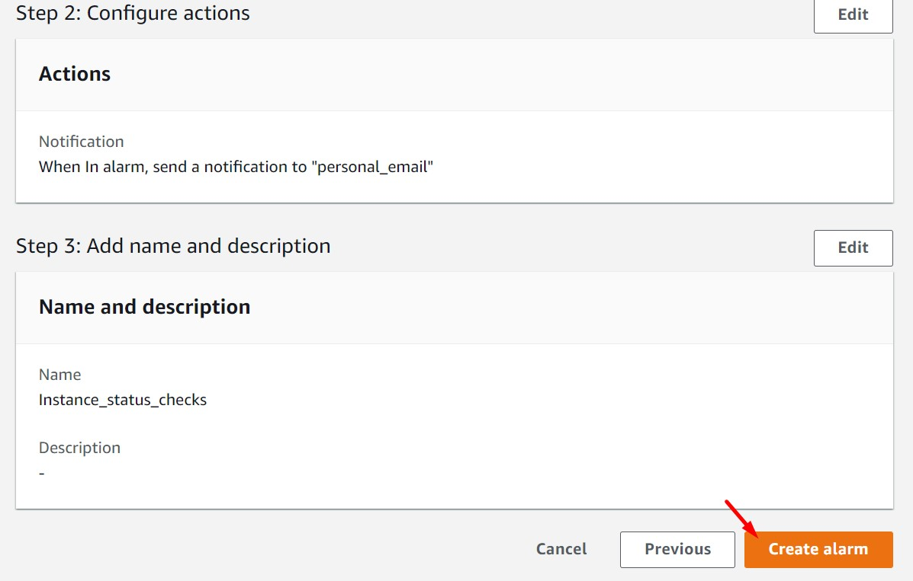

17. Validamos la creación de la alarma
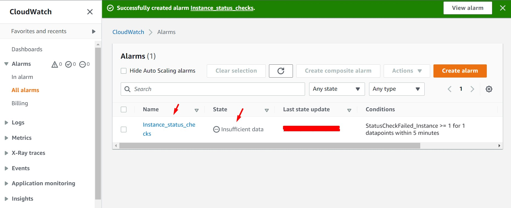

18. Esperamos unos pocos minutos para que la alarma recopile información. Esta cambiará al estado "In Alarm".
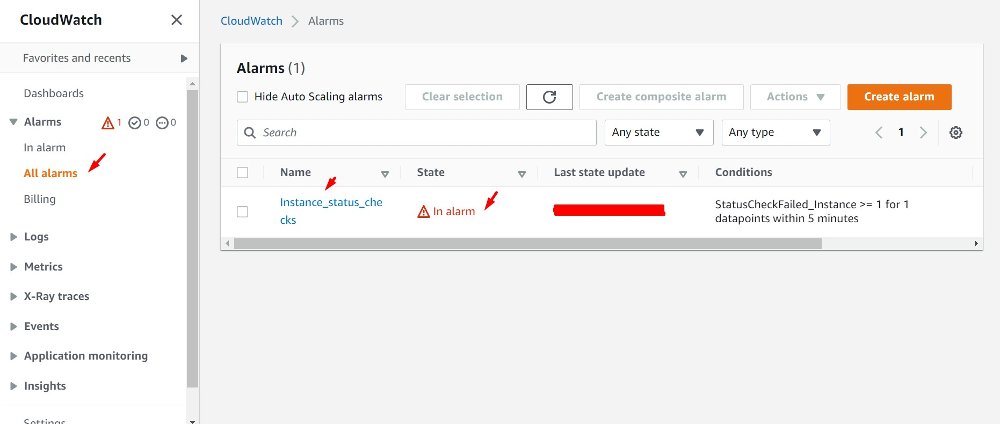

19. Validar en nuestra bandeja de email, la recepción del correo "ALARM: Instance_status_checks" in US East (N. Virginia)"
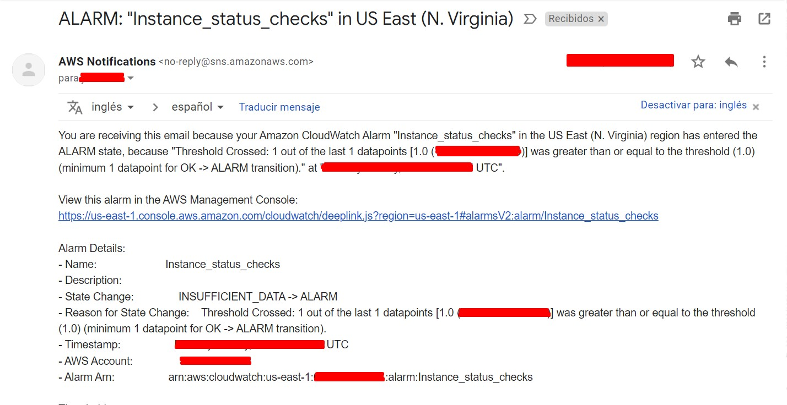

