# AWS Cloud Practitioner - Laboratorio 04 

### Objetivo: 
* Interactuar con el servicio AWS CloudFormation
* Identificar características de los siguientes servicios de AWS: EC2, EBS, S3 y VPC

---

### A - Actividades Técnicas
<br>

1. Debemos tener una llave Key Pair disponible. De no ser así, acceder al servicio EC2 y luego a la opción "Key Pair". Generar llave RSA y .pem 

2. Acceder al servicio AWS CloudFormation y dar clic en el botón "Create Stack"

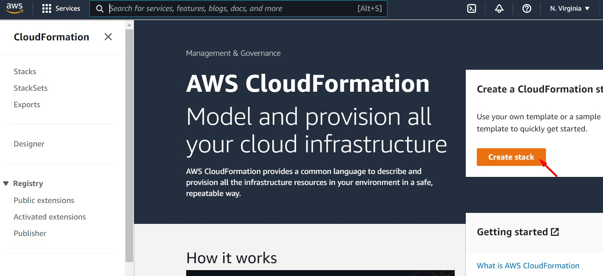
<br>

3. Seleccionar las opciones "Template is ready" y "Upload a template file". Luego, buscar el archivo "lab04_cloudformation_s3_ec2_db.yaml" y subirlo a AWS CloudFormation (El template se encuentra en: https://github.com/jbarreto7991/aws-cloudpractitioner/blob/main/Lab-04/code/lab04_cloudformation_s3_ec2_db.yaml). Dar clic en el botón "Next"  

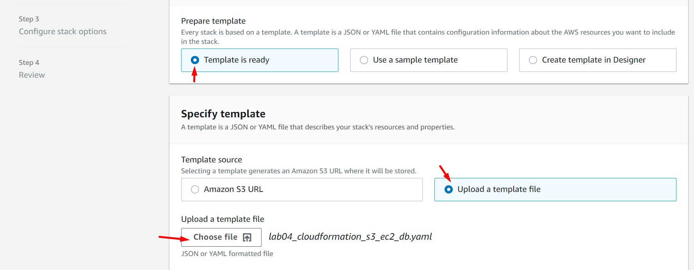
<br>
<br>

4. Ingresar los siguientes datos en la sección "Stack name"
* Stack name: Lab04

<br>

5. Ingresar los siguientes datos en la sección "Parameters". Luego, dar clic en el botón "Next".

* InstancesFamily: Dejar valores por defecto. La instancia EC2 tomará el primer valor de esta lista.
* KeyPair: Seleccionar llave indicada en el paso 1
* S3BucketName: Ingresar un valor único a nivel global. Se recomienda la estructura: nombre-apellido-aws-cloudpractitioner
* SubnetCIDR1: Dejar valor por defecto
* SubnetCIDR2: Dejar valor por defecto
* VPCCIDR: Dejar valor por defecto. De tener una VPC con CIDR 192.168.0.0/16, modificar valor CIDR por uno donde no exista el solapamiento de redes. Las SubnetCIDR1 y SubnetCIDR2 deben formar parte del VPCCIDR.

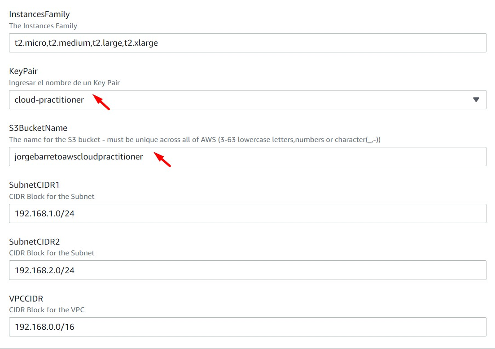
<br>
<br>

6. No realizar cambios en las secciones "Configure stack options" o "Advanced options". Dar clic en el botón "Next".

<br>

7. En la sección "Capabilities" del último paso dar clic en el checkbox "I acknowledge that AWS CloudFormation might create IAM resources". Luego, dar clic en el botón "Create Stack"

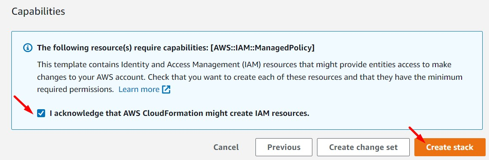

8. Esperar unos minutos mientras AWS CloudFormation aprovisiona todos los recursos declarados en la plantilla. 

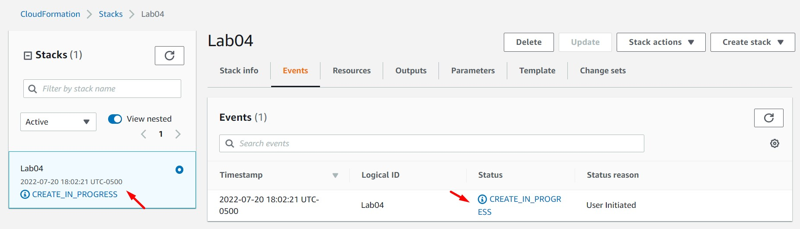
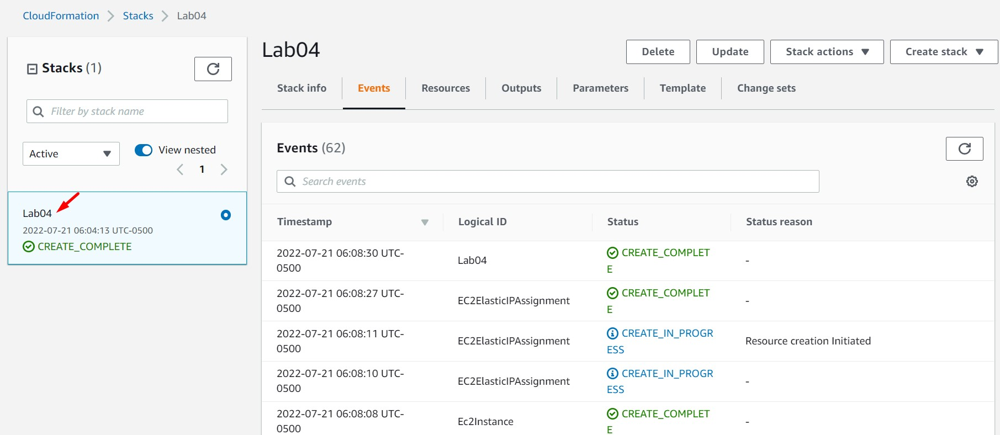

9. Analizar las opciones que muestran los servicios AWS CloudFormation, EC2, EBS, VPC y S3.


---
### B - Análisis de los recursos aprovisionados

<br>

Mientras se analizan los siguientes recursos aprovisionados. Diagramar la arquitectura desplegada anteriormente. Se recomienda el uso de "https://app.diagrams.net/"


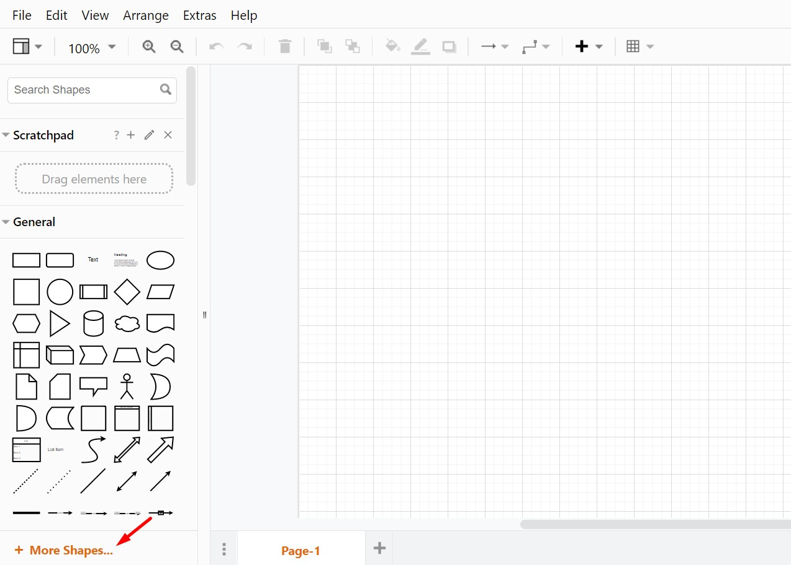
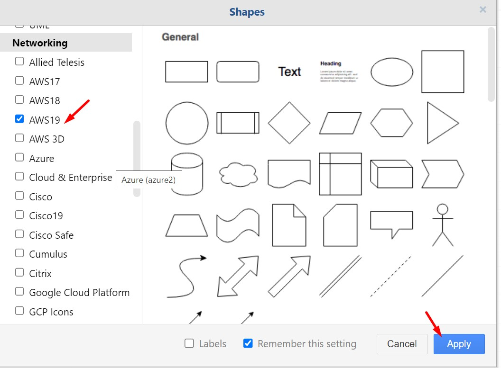
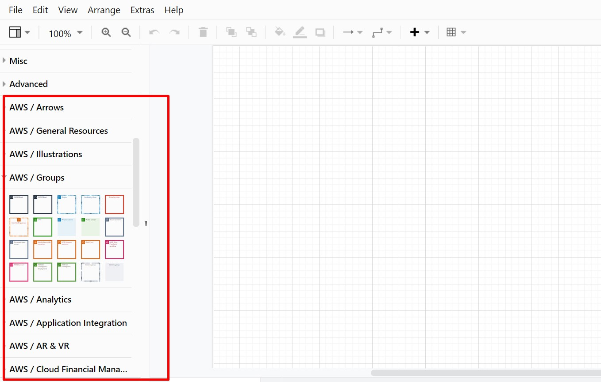

<br>

### **Networking Services**

Listar los siguientes componentes:

#### **VPC (Virtual Private Cloud)**

1. VPC ID
2. IPv4 CIDR
3. DNS Hostname
4. DNS Resolution


#### **Subnet**

1. Subnet ID
2. IPv4 CIDR
3. Availability Zone
4. Availability Zone ID
5. Available IPv4 addresses
6. Auto-assign public IPv4 address


#### **Internet Gateway**

1. Internet Gateway ID
2. VPC ID

#### **Route Table**

1. Route Table ID
2. Routes
3. Subnet Associations

#### **NACL (Network Access Control List)**

1. NACL ID
2. Inbound Rules
3. Outbound Rules
4. Subnet Association

<br>


### **Compute Services**

Listar los siguientes componentes:

#### **EC2 (Elastic Compute Cloud)**

1. Instances ID
2. Public IPv4 address
3. Private IPv4 address
4. Instance state
5. Public IPv4 hostname
6. Private IPv4 hostname
7. Instance Type
8. Elastic IP address
9. IAM Role
10. Subnet ID
11. AMI ID
12. Key Pair name
13. Subnet ID
14. Availability Zone
15. Network Interface ID

<br>

### **Storage Services**

Listar los siguientes componentes:

#### **EBS (Elastic Block Storage)**

1. Volume ID
2. Type
3. Size
4. Volume State
5. IOPS
6. Throughput
7. Encryption
8. KMS Key Alias
9. Snapshot
10. Availability Zone
11. Attached Instances


#### **S3 (Simple Storage Services)**

1. Bucket Name
2. Objects - Storage Class 
3. Properties - Bucket Versioning
4. Properties - Default Encryption
5. Properties - Static website hosting - Static website hosting
6. Properties - Static website hosting - Bucket website endpint
7. Permissions - Permissions overview - Access
8. Permissions - Block Public Access
9. Permissions - Bucket Policy
10. Permissions - Access control list (ACL)


---
### C - Análisis de la aplicación aprovisionada

<br>

1. Ir al servicio S3 > Properties > Static website hosting > Bucket website endpoint. Dar clic en el enlace.

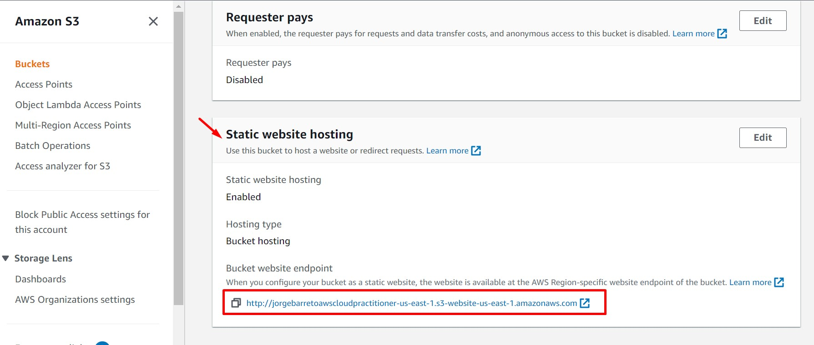
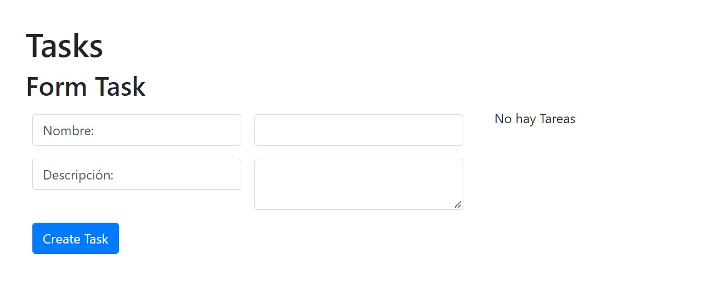

2. Ingresar valores en el campo "Nombre" y en el campo "Descripción". Dar clic en el botón "Create Task"

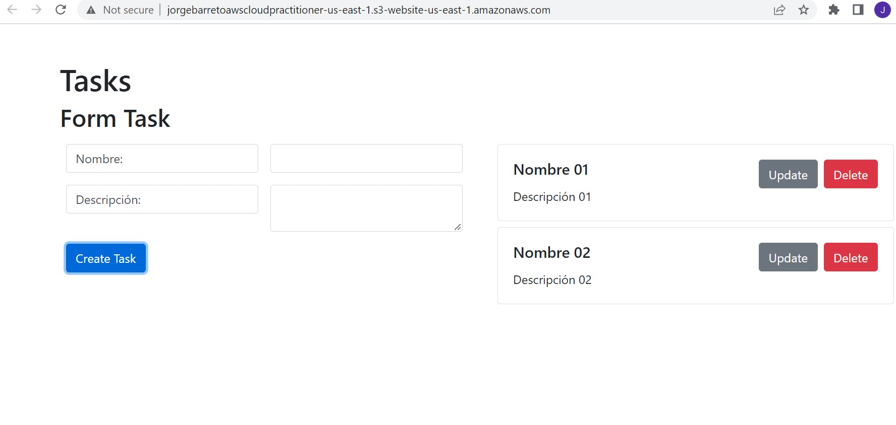

<br>

3. Acceder al servidor. Deberemos identificar previamente la IP Pública de la instancia aprovisionada.

```bash
ssh -i PATH/key_pair ubuntu@PUBLIC_IP
ssh -i .\cloud-practitioner.pem ubuntu@44.208.197.7
```
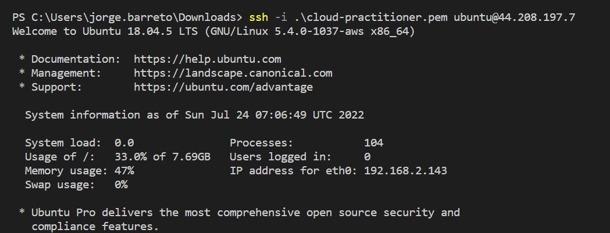

<br>

4. Identificamos los siguientes componentes:

    a. Volúmenes asociados a la instancia
    ```bash
    lsblk -fm
    df -h
    cat /etc/fstab
    ```

    b. Versión AWSCLI y listado de recursos
    ```bash
    aws --version
    aws s3 ls
    aws ec2 describe-instances --region us-east-1
    aws cloudformation list-stacks --region us-east-1
    ```

    c. Contenido de directorio
    ```bash
    cd /opt/aws-cloudpractitioner/App
    ```
    
    d. Base de datos
    ```bash
    mysql
    SELECT User, Host FROM mysql.user;
    quit

    mysql –u admin –p
    [password: admin]
    show databases;
    use test;
    show tables;
    select * from tasks;
    ```

    
    
    <br>

    e. Security Groups asociados a la Instancias. ¿A qué se deben estos múltiples registros?

    ```bash
    curl https://ip-ranges.amazonaws.com/ip-ranges.json | jq -r  '.prefixes[] | select(.region=='\"$REGION\"') | select(.service=="S3") | .ip_prefix' > /opt/tmp_ip_s3_list
    while read IP_S3_LIST; do
    aws ec2 authorize-security-group-ingress --group-id $SECURITY_GROUP_ID --protocol tcp  --port 80 --cidr $IP_S3_LIST --region $REGION
    done < /opt/tmp_ip_s3_list
        ```