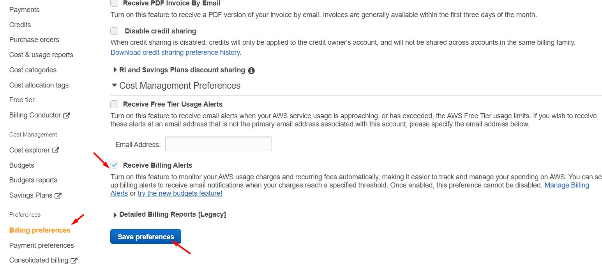
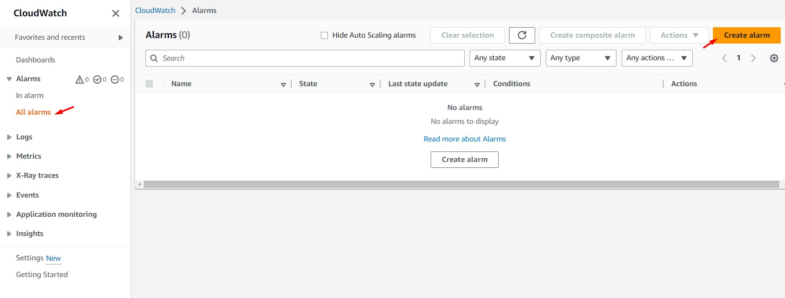
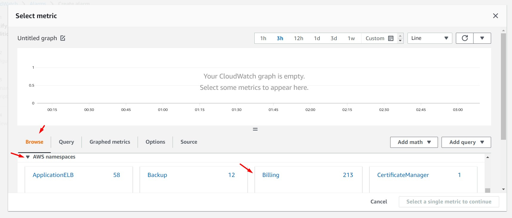
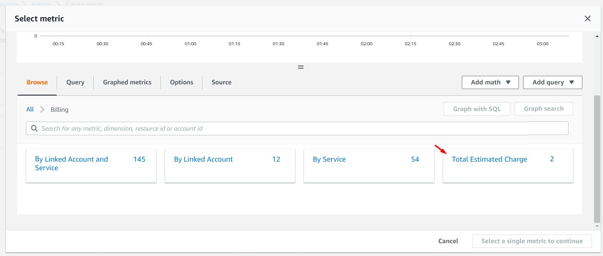
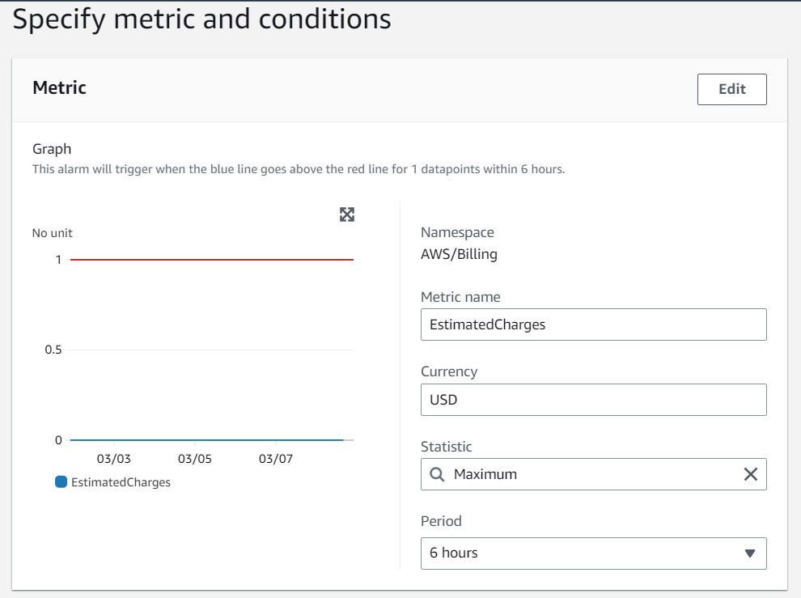
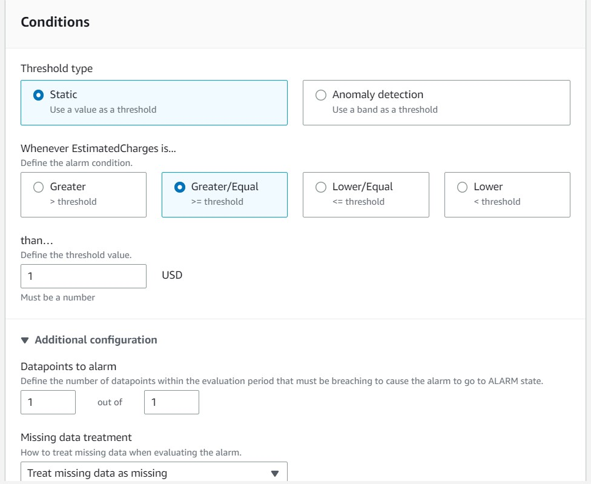
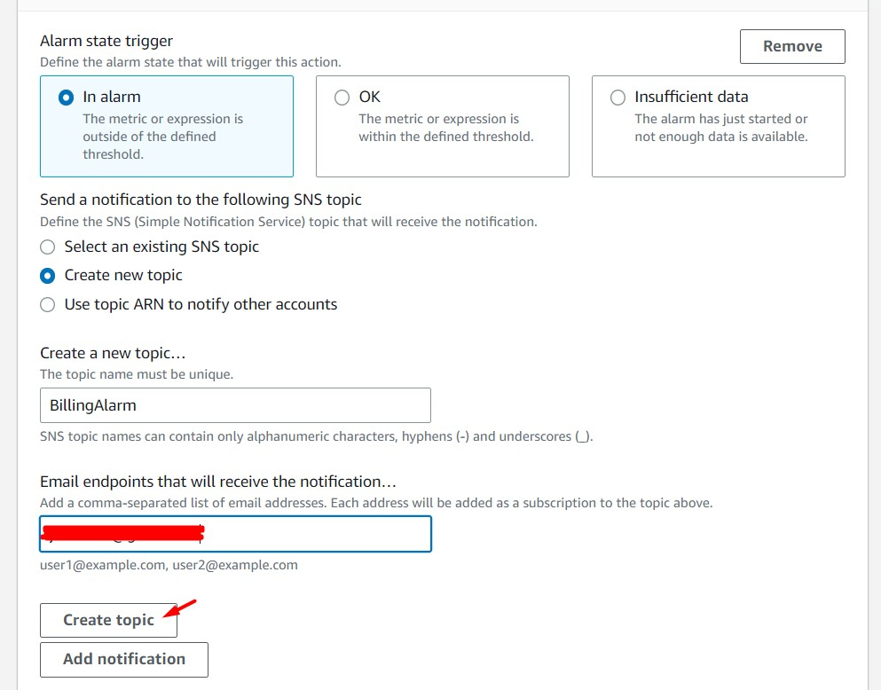
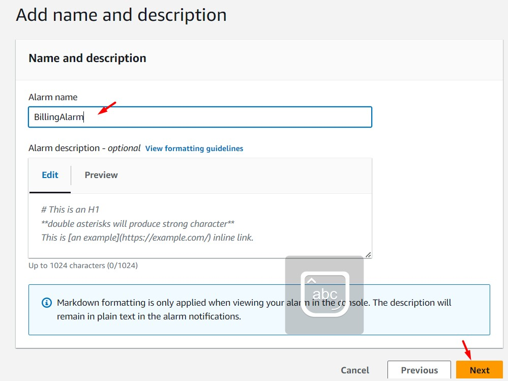
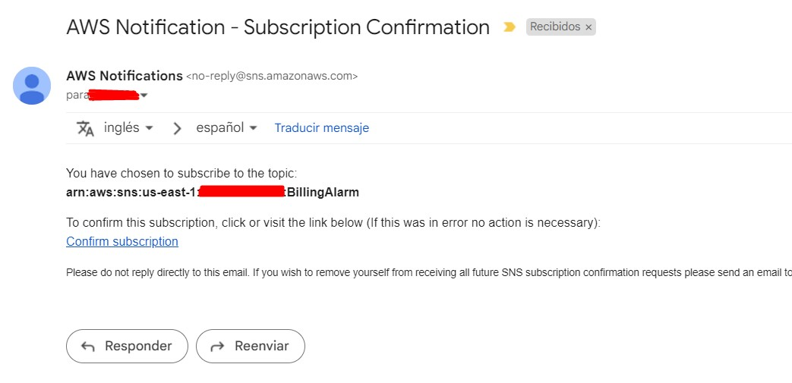
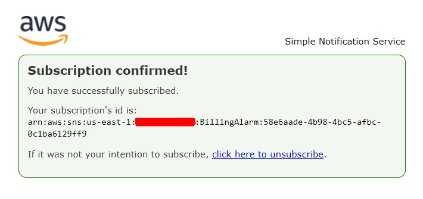

# AWS Cloud Practitioner - Laboratorio 05

### Objetivo: 
* Configuración de alarma de facturación en AWS vía Billing y CloudWatch Alarm

---

### A - Habilitación de Alertas de Facturación

 

1. Debe iniciar sesión con las credenciales de usuario raíz de la cuenta o como un usuario de IAM al que se le ha otorgado permiso para ver la información de facturación.

 

2. Abrir la consola de facturación de AWS en https://console.aws.amazon.com/billing/.

 

3. En el panel de navegación, seleccione "Billing Preferences" (Preferencias de facturación). Dar clic en el check "Receive Billing Alerts" y luego en el botón "Save preferences"

 

4. Después de habilitar las alertas de facturación por primera vez, AWS tarda unos 15 minutos antes de que pueda ver los datos de facturación y configurar las alarmas de facturación.

### B - Creación de Alertas de Facturación

 

5. Antes de crear una alarma de facturación, debe establecer su Región en EE. UU. Este (Norte de Virginia).

 

6. Abrir la consola de CloudWatch en https://console.aws.amazon.com/cloudwatch/. En el panel de navegación, elija "Alarms" y luego elija "All Alarms". Dar clic en el botón "Create Alarm"

 

7. Dar clic en "Select metric". En la sección "AWS namespaces", seleccionar "Billing" y seleccionar "Total Estimated Charge". Seleccionar "EstimatedCharges" y dar clic en el botón "Select metric".

 

 

 

8. Seleccionar/ingresar los siguientes valores. Dar clic en el botón "Next". La configuración indica que al gastar en AWS un monto mayor o igual a 1 USD, AWS realizará un acción (a ser detallada en los siguientes puntos)

    * Metric name: EstimatedCharges
    * Currency: USD
    * Statistic: Maximum
    * Period: 6 hours
    * Threshold type: Static
    * Whenever EstimatedCharges is...: Greater/Equal
    * than…: 1 USD
    * Datapoints to alarm: 1 out of 1
    * Missing data treatment: Treat missing data as missing

 

 

9. Dar clic en el botón "Add Notification". Seleccionar/ingresar los siguientes valores:

    * Alarm state trigger: In alarm
    * Send a notification to the following SNS topic: Create new topic
    * Create a new topic…: BillingAlarm
    * Email endpoints that will receive the notification…: "Ingresar correo electrónico"

 

10. Dar clic en "Create Topic" y luego dar clic en "Next". Ingresamos un nombre a nuestra alarma (p.ej. BillingAlarm) y damos clic en el botón "Next". Verificamos los valores ingresados y damos clic en "Create Alarm"

 

11. Al buzón del correo electrónico ingresado en el paso 9, habrá llegado un mensaje de confirmación (Subject: AWS Notification - Subscription Confirmation). Dar clic en el enlace "Confirm subscription". Nuestro correo electrónico estará correctamente validado.

 

 
