# AWS Cloud Practitioner - Laboratorio 06

### Objetivo: 
* Interactuar con el servicio AWS CloudFormation
* Identificar características de los siguientes servicios de AWS: VPC, RDS, Secret Manager, EFS, EC2, S3, ALB, Cloud9, EC2 AutoScaling Group, SNS, CloudWatch, CloudFront

---

### A - Actividades Técnicas
<br>

1. Debemos tener una llave Key Pair disponible. De no ser así, acceder al servicio EC2 y luego a la opción "Key Pair". Generar llave RSA y .pem 

2. Acceder al servicio AWS Cloud9 y dar clic en el botón "Create environment"


<br>

3. Ingresar "nombre" y "descripción". Dar clic en el botón "Next step"


<br>

4. Dejar los valores por defecto. En la sección "Platform" seleccionar "Ubuntu 18.04 TLS". Dar clic en "Next Step"


<br>

5. Revisar los valores previamente seleccionados. De estar todo correcto dar clic en el botón "Create enviroment"

6. Esperar unos minutos mientras el ambiente carga.


<br>

<br>

7. Ejecutar los siguinentes comandos


```bash
#Ubuntu 18.04
sudo apt-get update
git clone https://github.com/jbarreto7991/aws-cloudpractitioner.git
```


<br>

8. Acceder al laboratorio 06, carpeta "code". Validar que se cuenta con varios archivos CloudFormation con extensión .yaml. Analizar el contenido de estos archivos.


<br>

9. Desplegar cada plantilla CloudFormation ejecutando AWSCLI. Considerar los parámetros a ser ingresados.

    <br>
10. **1_lab06-vpc.yaml** (Esperar el despliegue total de esta plantilla cloudformation para continuar con las demás plantillas). En la sección "ParameterValue", ingresar el nombre del KeyPair creado en el paso 1. Esta plantilla creará la VPC "192.168.0.0/16" Y 06 Subnets dentro de este CIDR. No deberán existir redes existentes en este rango de IPs. Validar la creación del Stack desde la consola AWS a través del servicio AWS CloudFormation. Analizar el servicio **VPC** y el diagrama de arquitectura facilitado. El siguiente comando considera el valor "cloud-practitioner" para el KeyPair, reemplazar el nombre según la llave respectiva.

```bash
aws cloudformation create-stack --stack-name lab06-vpc --template-body file://~/environment/aws-cloudpractitioner/Lab-06/code/1_lab06-vpc.yaml --parameters ParameterKey=KeyPair,ParameterValue="cloud-practitioner" --capabilities CAPABILITY_IAM
```
    

<br>


<br>

11. **2_lab06-secretmanager-rds.yaml** (Esta y la siguiente plantilla se podrán desplegar de forma paralela). La plantilla solicita el ingreso de 3 parámetros. Se considera el uso de los valores por defecto para estos parámetros. Analizar el servicio **Secret Manager** y **RDS** y el diagrama de arquitectura facilitado. Esta plantilla tomará varios minutos en su despliegue debido al aprovisionamiento de la base de datos.

```bash
aws cloudformation create-stack --stack-name lab06-secretmanager-rds --template-body file://~/environment/aws-cloudpractitioner/Lab-06/code/2_lab06-secretmanager-rds.yaml 
```
   
<br>

12. **3_lab06-efs.yaml** (Esta y la anterior plantilla se podrán desplegar de forma paralela). La plantilla no tiene parámetros. Analizar el servicio de **EFS** y el diagrama de arquitectura facilitado.

```bash
aws cloudformation create-stack --stack-name lab06-efs --template-body file://~/environment/aws-cloudpractitioner/Lab-06/code/3_lab06-efs.yaml 
```

<br>

13. **4_lab06-ec2-s3.yaml**  (Esta plantilla necesita que la plantilla 2_lab06-secretmanager-rds.yaml finalice su despliegue. Esta y la siguiente plantilla se podrán desplegar de forma paralela). La plantilla tiene 3 parámetros, 2 son obligatorios: "KeyPair" (Llave creada en el paso 01) y "S3BucketName" (Nombre del Bucket a crear, el nombre debe ser único a nivel mundial. Se recomienda usar el patrón nombre-apellido-cloud-practitioner). Analizar los servicios **EC2** y **S3** y el diagrama de arquitectura facilitado. Esperar unos minutos mientras la aplicación se despliega. El siguiente comando considera el valor "cloud-practitioner" para el KeyPair y el valor "jorge-barreto-cloud-practitioner" para el S3BucketName. reemplazar según sea conveniente.

```bash
aws cloudformation create-stack --stack-name lab06-ec2-s3 --template-body file://~/environment/aws-cloudpractitioner/Lab-06/code/4_lab06-ec2-s3.yaml --parameters ParameterKey=KeyPair,ParameterValue="cloud-practitioner" ParameterKey=S3BucketName,ParameterValue="jorge-barreto-cloud-practitioner" --capabilities CAPABILITY_IAM
```

<br>

14. **5_lab06-alb-targetgroup.yaml**  (Esta y la anterior plantilla se podrán desplegar de forma paralela). La plantilla no tiene parámetros. Analizar los features del servicio EC2 **ALB (Application Load Balancer), Target Group y Listener** y el diagrama de arquitectura facilitado.

```bash
aws cloudformation create-stack --stack-name lab06-alb-targetgroup --template-body file://~/environment/aws-cloudpractitioner/Lab-06/code/5_lab06-alb-targetgroup.yaml
```

<br>

15. A través del endpoint del sitio estático de S3 podemos validar el funcionamiento de nuestra app. Actualmente el servicio S3 (Frontend) apunta a la IP Pública de nuestra instancia EC2 (Backend) y este apunta a nuestra base de datos RDS. Los comandos a continuación detallan los pasos a seguir para desplegar un balanceador, con el objetivo que nuestro Frontend (S3) no direccione directamente a una instancia EC2 sino a una balanceador tipo ALB. Se deberá validar que se haya finalizado el despliegue del balanceador del paso anterior.


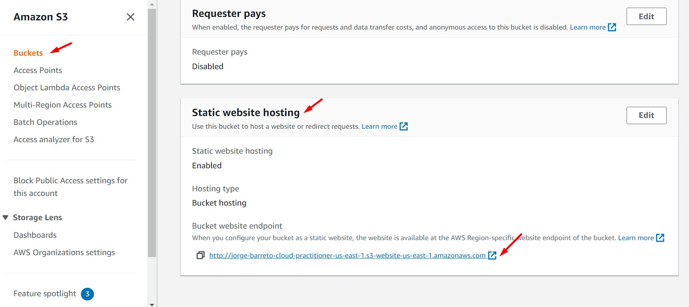
<br>

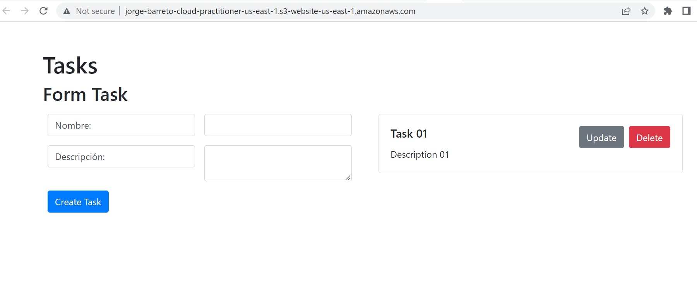
<br>

```bash

#Ubuntu 18.04
rm -rf /home/ubuntu/environment/aws-cloudpractitioner/
git clone https://github.com/jbarreto7991/aws-cloudpractitioner.git
sudo apt-get install jq -y

#Obteniendo nombre de DNS del Balanceador
REGION=$(curl -s http://169.254.169.254/latest/meta-data/placement/availability-zone | sed 's/\(.*\)[a-z]/\1/')
ALB_DNS_NAME=$(aws elbv2 describe-load-balancers --region $REGION | jq -r '.LoadBalancers[] | .DNSName')

#Reemplazando parámetro en archivo de configuración del frontend - Frontend
sed 's+http://$PUBLIC_IP/v1+http://'"$ALB_DNS_NAME"'/v1+g' ~/environment/aws-cloudpractitioner/App/frontend/src/config/axios.js >> ~/environment/aws-cloudpractitioner/App/frontend/src/config/bk_axios.js
rm ~/environment/aws-cloudpractitioner/App/frontend/src/config/axios.js
mv ~/environment/aws-cloudpractitioner/App/frontend/src/config/bk_axios.js ~/environment/aws-cloudpractitioner/App/frontend/src/config/axios.js

#Compilar frontend
cd ~/environment/aws-cloudpractitioner/App/frontend
npm install
npm run build
cd ~/environment/aws-cloudpractitioner/App/frontend/build/

#Enviar actualización a S3
BUCKET=$(aws s3 ls | sort -r | awk 'NR ==1 { print $3 }')
aws s3 sync . s3://$BUCKET

#Registrar instancia EC2 a Target Group del Balanceador
ALB_ARN=$(aws elbv2 describe-load-balancers | jq -r '.LoadBalancers[] | .LoadBalancerArn')
TARGETGROUP_ARN=$(aws elbv2 describe-target-groups --load-balancer-arn $ALB_ARN | jq -r '.TargetGroups[] | .TargetGroupArn')
INSTANCES_ID=$(aws ec2 describe-instances --filters Name=tag-value,Values="EC2 BACKEND" | jq -r '.Reservations[] | .Instances[] | .InstanceId')
aws elbv2 register-targets --target-group-arn $TARGETGROUP_ARN --targets Id=$INSTANCES_ID,Port=80
```

<br>


16. **6_lab06-alb-autoscaling-launchconfiguration.yaml** (Esta plantilla necesita que la AMI generada desde la plantilla 4_lab06-ec2-s3.yaml finalice su creación, además de finalizar el despliegue de las plantillas anteriores. Esta y la siguiente plantilla se podrán desplegar de forma paralela). La plantilla tiene 4 parámetros, 2 de ellos son obligatorios: "Key Pair" y "AmiInstances". Respecto a "Key Pair" ingresar el valor detallado en el paso 1. Sobre el parámetro "AmiInstances" ir a la sección AMIs de EC2 y copiar el valor del campo "AMI ID" o ejecutar el primer comando AWSCLI mostrado a continuación. Analizar los features del servicio EC2 **Launch Configuration de la sección Auto Scaling en EC2** y el diagrama de arquitectura facilitado. El siguiente comando considera el valor "cloud-practitioner" para el KeyPair y el valor "ami-0cc9a640553205d60" para el AmiInstances. Reemplazar según sea conveniente.

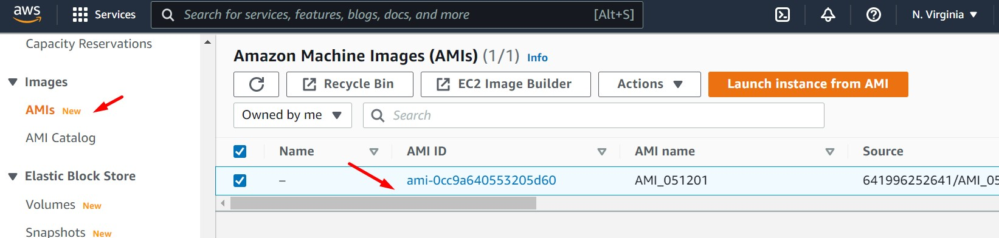
<br>

```bash
aws ec2 describe-images --owners self

{
    "Images": [
        {
            "Architecture": "x86_64",
            "CreationDate": "XXXX-XX-XXTXX:XX:XX.XXXZ",
            "ImageId": "ami-0cc9a640553205d60",
            "ImageLocation": "XXXXXXXXXXXX/AMI_XXXXXX",
            "ImageType": "machine",
            "Public": false,
            "OwnerId": "XXXXXXXXXXXX",
            "PlatformDetails": "Linux/UNIX",
            "UsageOperation": "RunInstances",
            "State": "available",
            "BlockDeviceMappings": [
                {
                    "DeviceName": "/dev/sda1",
                    "Ebs": {
                        "DeleteOnTermination": true,
                        "SnapshotId": "snap-06fe58e2fbc251931",
                        "VolumeSize": 8,
                        "VolumeType": "gp2",
                        "Encrypted": true
                    }
                },
                {
                    "DeviceName": "/dev/sdb",
                    "Ebs": {
                        "DeleteOnTermination": true,
                        "SnapshotId": "snap-04b600c013e15485e",
                        "VolumeSize": 8,
                        "VolumeType": "gp2",
                        "Encrypted": true
                    }
                },
                {
                    "DeviceName": "/dev/sdc",
                    "VirtualName": "ephemeral1"
                }
            ],
            "EnaSupport": true,
            "Hypervisor": "xen",
            "Name": "AMI_XXXXXX",
            "RootDeviceName": "/dev/sda1",
            "RootDeviceType": "ebs",
            "SriovNetSupport": "simple",
            "VirtualizationType": "hvm"
        }
    ]
}
```

```bash
aws cloudformation create-stack --stack-name lab06-autoscaling-launchconfiguration --template-body file://~/environment/aws-cloudpractitioner/Lab-06/code/6_lab06-autoscaling-launchconfiguration.yaml --parameters ParameterKey=KeyPair,ParameterValue="cloud-practitioner" ParameterKey=AmiInstances,ParameterValue="ami-0cc9a640553205d60" --capabilities CAPABILITY_IAM
```


17. **7_lab06-sns.yaml**  (Esta y la anterior plantilla se podrán desplegar de forma paralela). La plantilla tiene 1 parámetro y este es obligatorio: "SNSSubscription". Ingresar el correo electrónico donde llegarán diferentes tipos de alertas. Una vez ingresado, AWS enviará un correo electrónico a la dirección ingresada con el objetivo de activar la subscripción. Analizar el servicio **SNS** y el diagrama de arquitectura facilitado. El siguiente comando considera el valor "example@domain.com" para el SNSSubscription. Reemplazar según sea conveniente.

```bash
aws cloudformation create-stack --stack-name lab06-sns --template-body file://~/environment/aws-cloudpractitioner/Lab-06/code/7_lab06-sns.yaml --parameters ParameterKey=SNSSubscription,ParameterValue="example@domain.com"
```

18. **8_lab06-autoscaling-asg.yaml**  (Esta plantilla necesitará que las anteriores plantillas hayan terminado su despliegue). La plantilla no tiene parámetros. Analizar el features **EC2 AutoScaling Group** y el diagrama de arquitectura facilitado.

```bash
aws cloudformation create-stack --stack-name lab06-autoscaling-asg --template-body file://~/environment/aws-cloudpractitioner/Lab-06/code/8_lab06-autoscaling-asg.yaml
```

19. En el paso 15 se indicaba el despliegue de nuestro sitio estático en S3, el cual redireccionaba inicialmente a una instancia EC2. Se hizo el cambio para que el sitio estático redireccione a una balanceador de aplicaciones (ALB). En estos últimos pasos hemos configurado el EC2 Autoscaling Group detrás del balanceador de aplicaciones. Actualmente detrás del balanceador de aplicaciones tenemos nuestra instancia EC2 inicial y además el EC2 Autoscaling Group. Será necesario eliminar la instancia inicial. Ejecutar los siguientes comandos. Validar que la aplicación sigue funcionando.


```bash
#Eliminar Instancia EC2 Original. Se detalla en esta sección el resultado del comando a través de un JSON

REGION=$(curl -s http://169.254.169.254/latest/meta-data/placement/availability-zone | sed 's/\(.*\)[a-z]/\1/')
INSTANCES_ID=$(aws ec2 describe-instances --filters Name=tag-value,Values="EC2 BACKEND" | jq -r '.Reservations[] | .Instances[] | .InstanceId')
aws ec2 terminate-instances --instance-id $INSTANCES_ID
```

{
    "TerminatingInstances": [
        {
            "CurrentState": {
                "Code": 32,
                "Name": "shutting-down"
            },
            "InstanceId": "i-0976cdcd3d1277603",
            "PreviousState": {
                "Code": 16,
                "Name": "running"
            }
        }
    ]
}

20. Desde la consola EC2 validaremos que existen 02 instancias EC2 con el nombre "ASG EC2 BACKEND" (esto debido a la configuración del valor "min" en el EC2 AutoScaling Group). Accederemos a cada instancia usando el servicio "EC2 System Manager - Session Manager". Dentro de la instancia ejecutar los siguientes comandos, al final validaremos que existe un servicio expuesto en el puerto 80. Hacer esto por cada instancia.

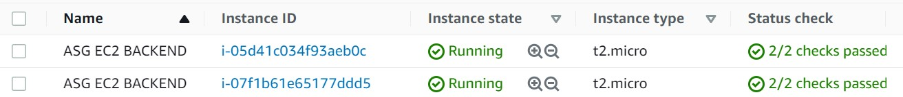
<br>

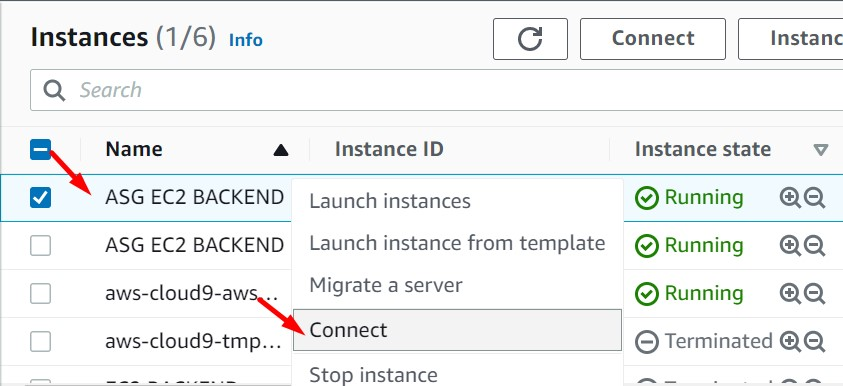
<br>


<br>

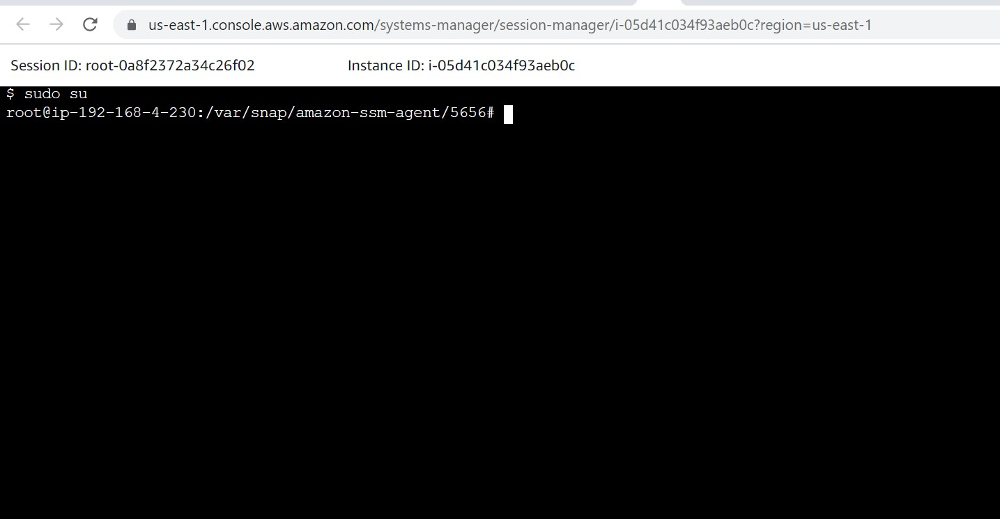
<br>

```bash
sudo su
cd /opt/aws-cloudpractitioner/App/backend/
npm start &
sudo lsof -t -i:80
```


21. **9_lab06-cloudwatch-alarm-asg.yaml** (Esta plantilla necesitará que las demás plantillas se hayan desplegado en su totalidad. Se podrá desplegar de forma paralela con la siguiente plantilla). La plantilla no tiene parámetros. Analizar el servicio **CloudWatch** y el diagrama de arquitectura facilitado.

```bash
aws cloudformation create-stack --stack-name lab06-cloudwatch-alarm-asg --template-body file://~/environment/aws-cloudpractitioner/Lab-06/code/9_lab06-cloudwatch-alarm-asg.yaml
```

22. Desde las instancias "ASG EC2 BACKEND" ejecutaremos los siguientes comandos con el propósito de estresar las instancias y visualizar el funcionamiento del autoescalado de las mismas. Analizar el servicio **CloudWatch**, los features **EC2 AutoScaling Group** e **EC2 Instances** y el diagrama de arquitectura facilitado.

```bash
sudo apt-get install stress
stress -c 4
```

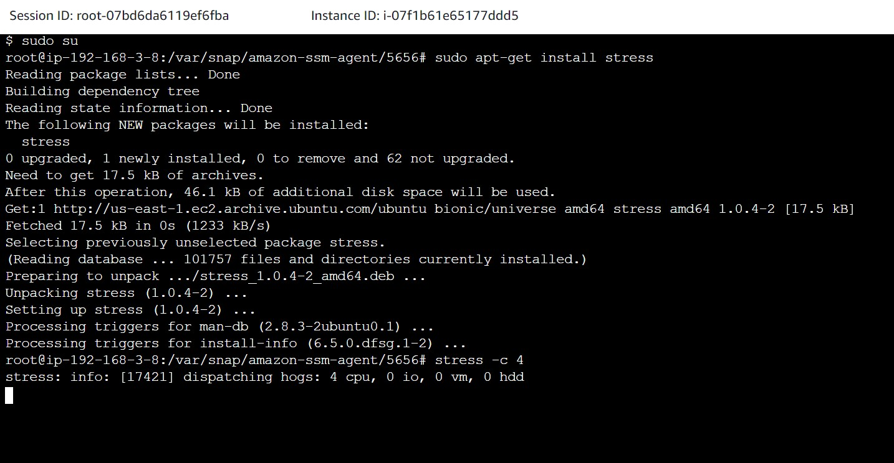
<br>


<br>

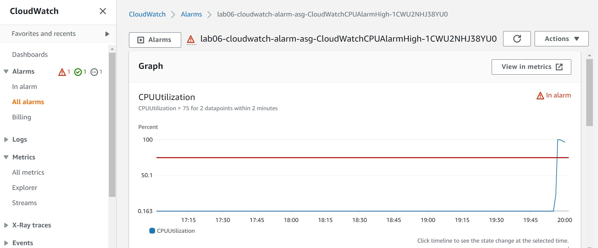
<br>

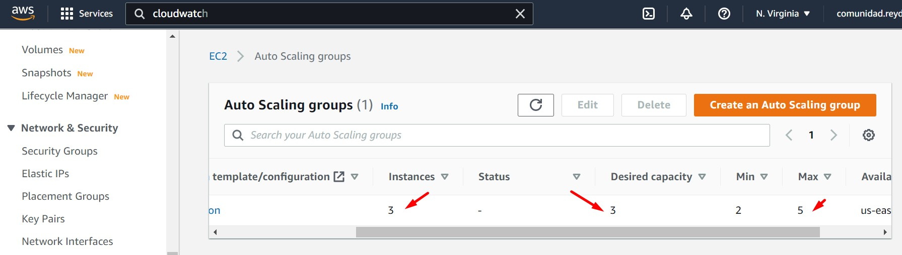
<br>

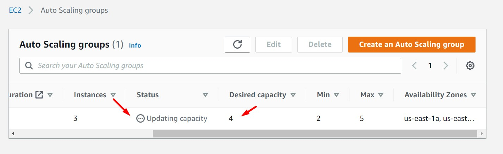
<br>

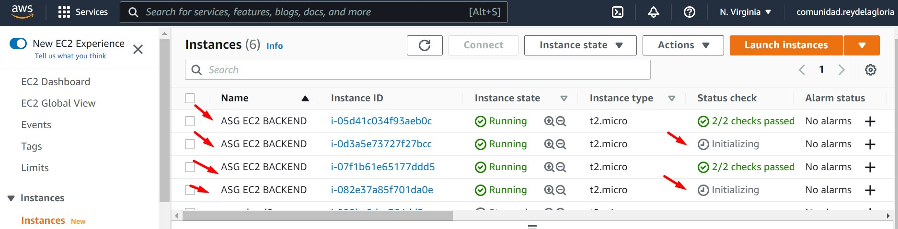
<br>


23. **10_lab06-cloudfront.yaml** (Esta plantilla necesitará que las demás plantillas se hayan desplegado en su totalidad. Se podrá desplegar de forma paralela con la anterior plantilla, pero por un tema metodológico se remienda su despliegue de forma aislada). La plantilla tiene dos parámetros de los cuales ambos son obligatorios. El parámetro "OAIEnabled" será asignado en "yes" y el parámetro "S3BucketName" será el nombre del bucket creado en el paso 13. Analizar el servicio **CloudFront** y la nueva política asignada al bucket **S3**, además de revisarel diagrama de arquitectura facilitado.

```bash
BUCKET=$(aws s3 ls | sort -r | awk 'NR ==1 { print $3 }')

aws cloudformation create-stack --stack-name lab06-cloudfront --template-body file://~/environment/aws-cloudpractitioner/Lab-06/code/10_lab06-cloudfront.yaml --parameters ParameterKey=OAIEnabled,ParameterValue="yes" ParameterKey=S3BucketName,ParameterValue=$BUCKET
```

24. Ingresar a la URL de la página web nuevamente. Validar que no se tiene acceso (403 Forbidden - Code: AccessDenied). Retirar algunas configuraciones del bucket S3 respecto a permisos públicos. Luego, ir al servicio "CloudFront" e ingresar al dominio que dispone AWS.

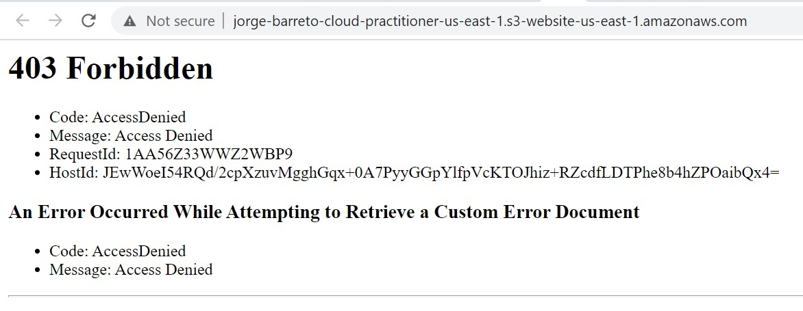
<br>

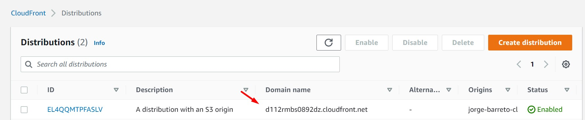
<br>


<br>
<br>


```bash
BUCKET=$(aws s3 ls | sort -r | awk 'NR ==1 { print $3 }')
aws s3api delete-bucket-website --bucket $BUCKET
aws s3api put-public-access-block --bucket $BUCKET --public-access-block-configuration "BlockPublicAcls=true,IgnorePublicAcls=true,BlockPublicPolicy=true,RestrictPublicBuckets=true"
aws s3api delete-bucket-policy --bucket $BUCKET
```

25. A esta aplicación podriamos además configurar los siguientes servicios:
    * Amazon Certificate Manager, para el cifrado en tránsito (SSL/TLS)
    * Amazon Route53, para la personalización del nombre del dominio
    * Amazon Cognito, para tener un login personalizado 

---

### Eliminación de recursos creados
<br>


```bash

#ELIMINACIÓN DE PLANTILLAS CLOUDFORMATION

#Ejecutar los siguientes comandos de forma paralela

aws cloudformation delete-stack --stack-name lab06-cloudfront
aws cloudformation delete-stack --stack-name lab06-cloudwatch-alarm-asg
aws cloudformation delete-stack --stack-name lab06-autoscaling-asg
aws cloudformation delete-stack --stack-name lab06-efs
aws cloudformation delete-stack --stack-name lab06-secretmanager-rds

#Continuar sólo si el Stack "lab06-autoscaling-asg" se eliminó

aws cloudformation delete-stack --stack-name lab06-sns
aws cloudformation delete-stack --stack-name lab06-autoscaling-launchconfiguration
aws cloudformation delete-stack --stack-name lab06-alb-targetgroup

#Continuar sólo si el Stack "lab06-alb-targetgroup" se eliminó 

aws s3 rm s3://$BUCKET --recursive
aws cloudformation delete-stack --stack-name lab06-ec2-s3

#Continuar sólo si el Stack "lab06-ec2-s3" se eliminó

aws cloudformation delete-stack --stack-name lab06-vpc

```

26. Eliminamos otros recursos generados durante el despliegue de la aplicación

27. Eliminación manual del ambiente generado en Cloud9

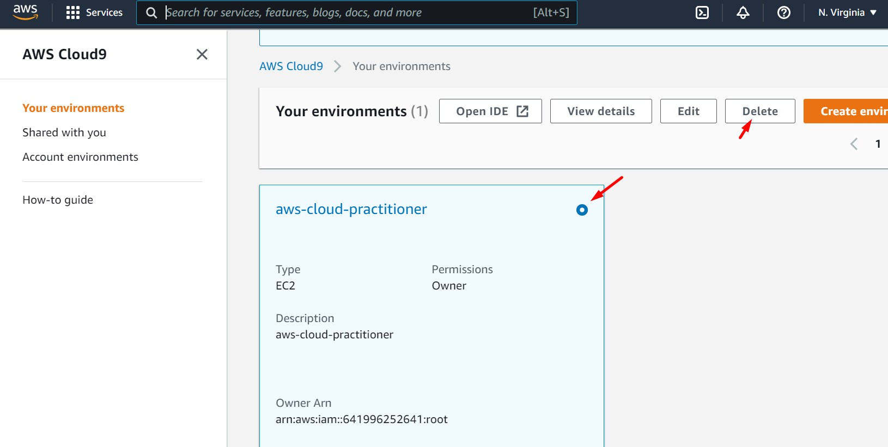
<br>

28. Eliminación manual de la AMI generada

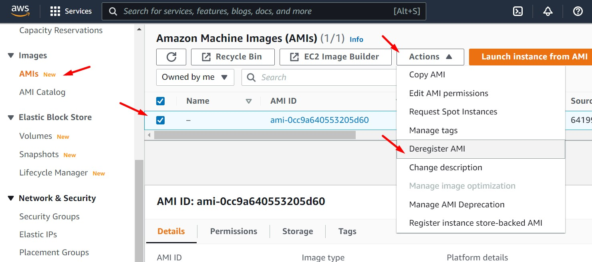
<br>

29. Eliminación manual de los snapshots generados

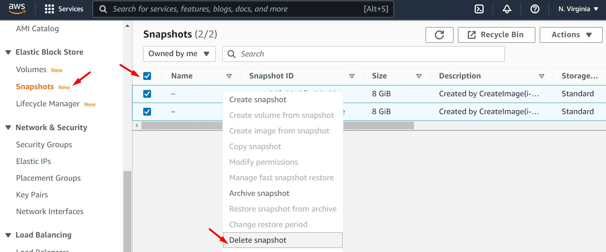
<br>

30. Validar si la "Elastic IP" se liberó. No deberá aparecer ningún registro.

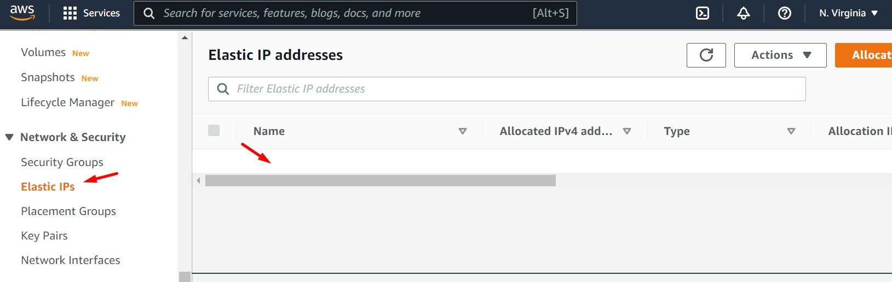
<br>

31. Eliminar bucket S3 generado en el paso 13.

```bash
aws s3api delete-bucket --bucket $BUCKET
```
