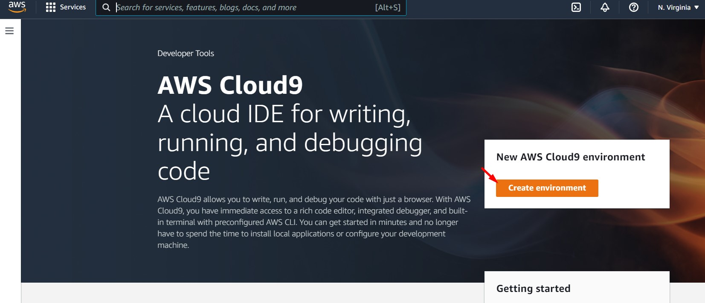
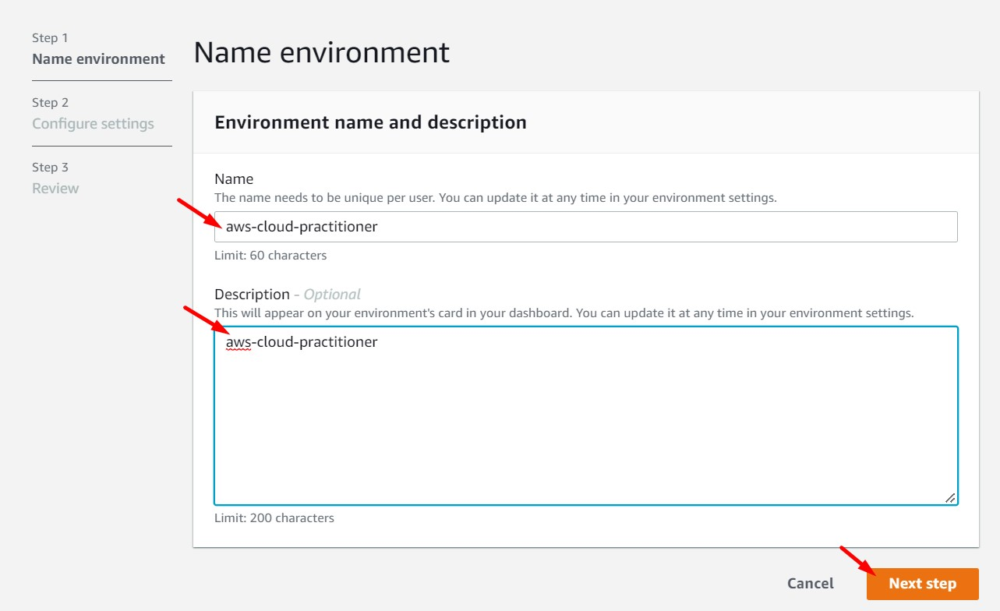
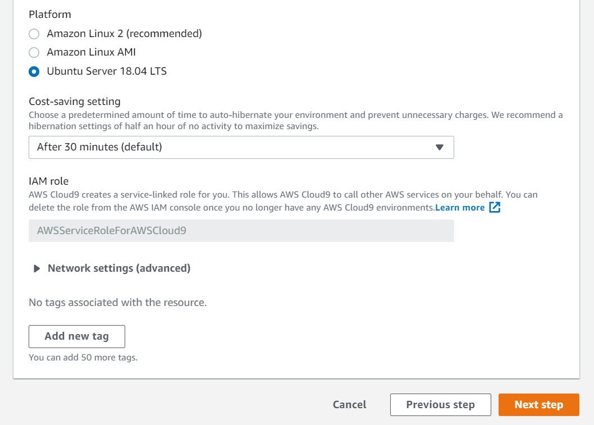
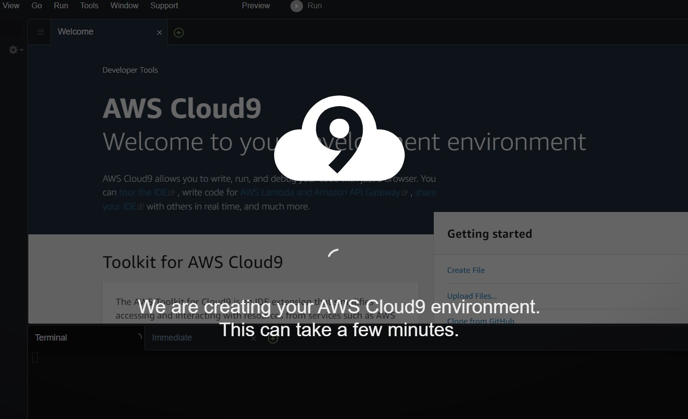
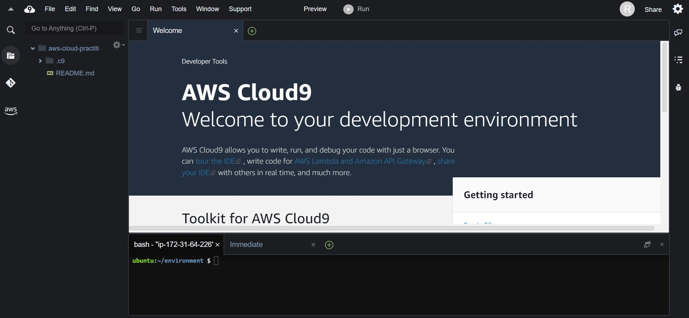
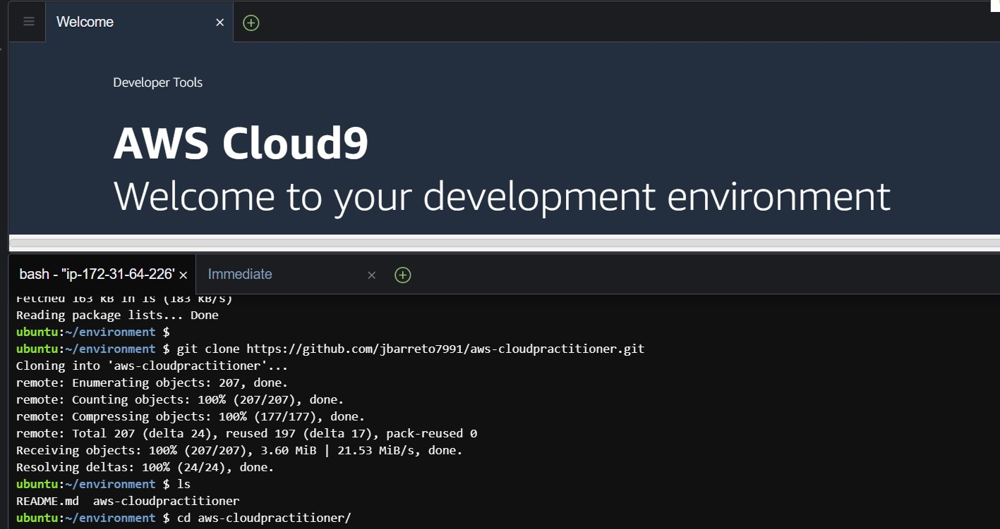
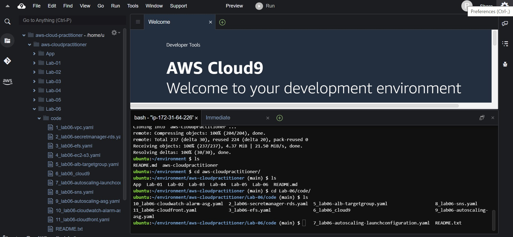
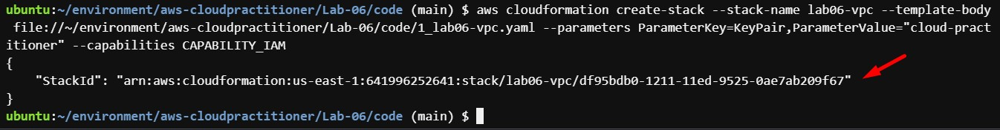
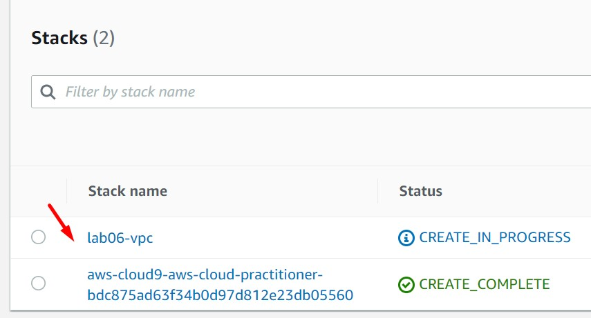

# AWS Cloud Practitioner - Laboratorio 06

### Objetivo: 
* Interactuar con el servicio AWS CloudFormation
* Identificar características de los siguientes servicios de AWS: VPC, RDS, Secret Manager, EFS, EC2, S3, ALB, Cloud9, EC2 AutoScaling Group, SNS, CloudWatch, CloudFront

---

### A - Actividades Técnicas
<br>

1. Debemos tener una llave Key Pair disponible. De no ser así, acceder al servicio EC2 y luego a la opción "Key Pair". Generar llave RSA y .pem 

2. Acceder al servicio AWS Cloud9 y dar clic en el botón "Create environment"


<br>

3. Ingresar "nombre" y "descripción". Dar clic en el botón "Next step"


<br>

4. Dejar los valores por defecto. En la sección "Platform" seleccionar "Ubuntu 18.04 TLS". Dar clic en "Next Step"


<br>

5. Revisar los valores previamente seleccionados. De estar todo correcto dar clic en el botón "Create enviroment"

6. Esperar unos minutos mientras el ambiente carga.



<br>

<br>

7. Ejecutar los siguinentes comandos


```bash
#Ubuntu 18.04
sudo apt-get update
git clone https://github.com/jbarreto7991/aws-cloudpractitioner.git
```


<br>

8. Acceder al laboratorio 06, carpeta "code". Validar que se cuenta con varios archivos CloudFormation con extensión .yaml. Analizar el contenido de estos archivos.


<br>

9. Desplegar cada plantilla CloudFormation ejecutando AWSCLI. Considerar los parámetros a ser ingresados.

    <br>
10. **1_lab06-vpc.yaml**. En la sección "ParameterValue", ingresar el nombre del KeyPair creado en el paso 1. Esta plantilla creará la VPC "192.168.0.0/16" Y 06 Subnets dentro de este CIDR. No deberán existir redes existentes en este rango de IPs. Validar la creación del Stack desde la consola AWS a través del servicio AWS CloudFormation. Analizar el servicio **VPC** y el diagrama de arquitectura facilitado.

```bash
aws cloudformation create-stack --stack-name lab06-vpc --template-body file://~/environment/aws-cloudpractitioner/Lab-06/code/1_lab06-vpc.yaml --parameters ParameterKey=KeyPair,ParameterValue="cloud-practitioner" --capabilities CAPABILITY_IAM
```
    

<br>


<br>

11. **2_lab06-secretmanager-rds.yaml**. La plantilla solicita el ingreso de 3 parámetros. Se considera el uso de los valores por defecto para estos parámetros. Analizar el servicio **Secret Manager** y **RDS** y el diagrama de arquitectura facilitado. Esta plantilla tomará varios minutos en su despliegue debido al aprovisionamiento de la base de datos.

```bash
aws cloudformation create-stack --stack-name lab06-secretmanager-rds --template-body file://~/environment/aws-cloudpractitioner/Lab-06/code/2_lab06-secretmanager-rds.yaml 
```
   
<br>

12. **3_lab06-efs.yaml**. La plantilla no tiene parámetros. Analizar el servicio de **EFS** y el diagrama de arquitectura facilitado.

```bash
aws cloudformation create-stack --stack-name lab06-efs --template-body file://~/environment/aws-cloudpractitioner/Lab-06/code/3_lab06-efs.yaml 
```

13. **4_lab06-ec2-s3.yaml**. La plantilla tiene 3 parámetros, 2 son obligatorios: "KeyPair" (Llave creada en el paso 01) y "S3BucketName" (Nombre del Bucket a crear, el nombre debe ser único a nivel mundial. Se recomienda usar el patrón nombre-apellido-cloud-practitioner). Analizar los servicios **EC2** y **S3** y el diagrama de arquitectura facilitado.

```bash
aws cloudformation create-stack --stack-name lab06-ec2-s3 --template-body file://~/environment/aws-cloudpractitioner/Lab-06/code/4_lab06-ec2-s3.yaml --parameters ParameterKey=KeyPair,ParameterValue="cloud-practitioner" ParameterKey=S3BucketName,ParameterValue="jorge-barreto-cloud-practitioner" --capabilities CAPABILITY_IAM
```
