# AWS Cloud Practitioner - Laboratorio 07

### Objetivo: 
* Interactuar con las APIs de AWS a través de la consola, awscli, IaC y SDK

---

### A - Implementación de Laboratorio
<br>

1. Generar una llave KeyPair "cloud-practitioner" o tener disponible una. De no ser así, acceder al servicio EC2 y luego a la opción "Key Pair". Generar llave seleccionando "RSA" y ".pem" 


<br>


<br>


2. Acceder al servicio AWS CloudFormation y dar clic en el botón "Create Stack"

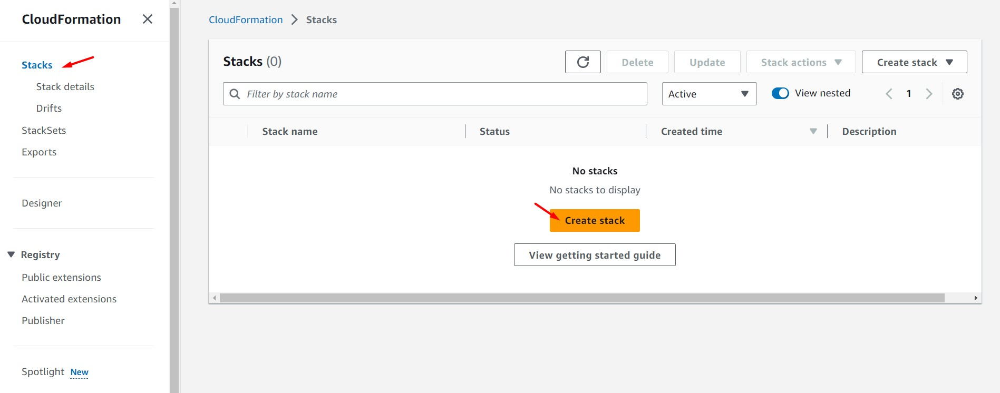
<br>

3. En la sección "Specify Template" seleccionar "Upload a template file" y dar clic en el botón "Choose file". Seleccionar la plantilla "1_lab07-vpc.yaml" ubicada en la carpeta "code"

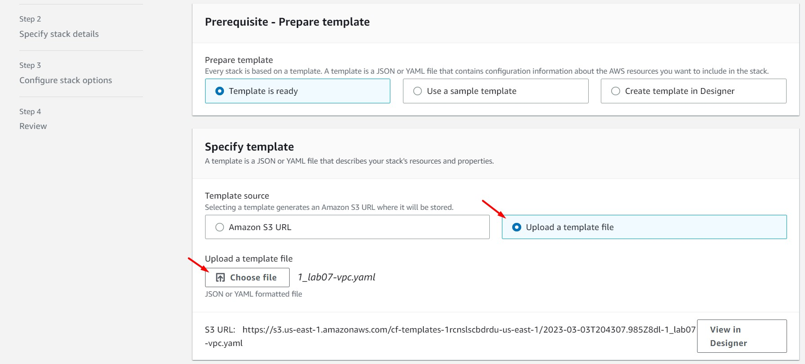
<br>

4. Ingresamos un nombre a nuestro "Stack" y en la sección "KeyPair" seleccionamos la llave indicada en el paso 1.

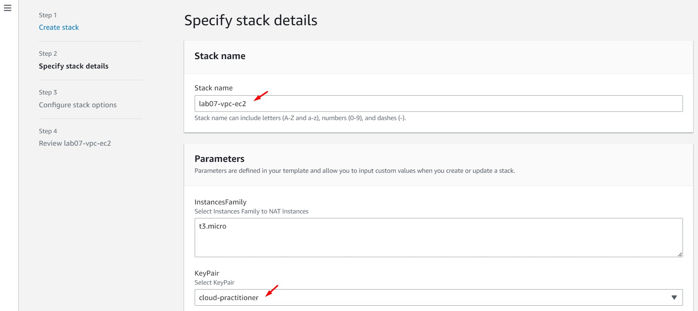
<br>

5. Dejamos los valores por defecto y damos clic en el botón "Next"

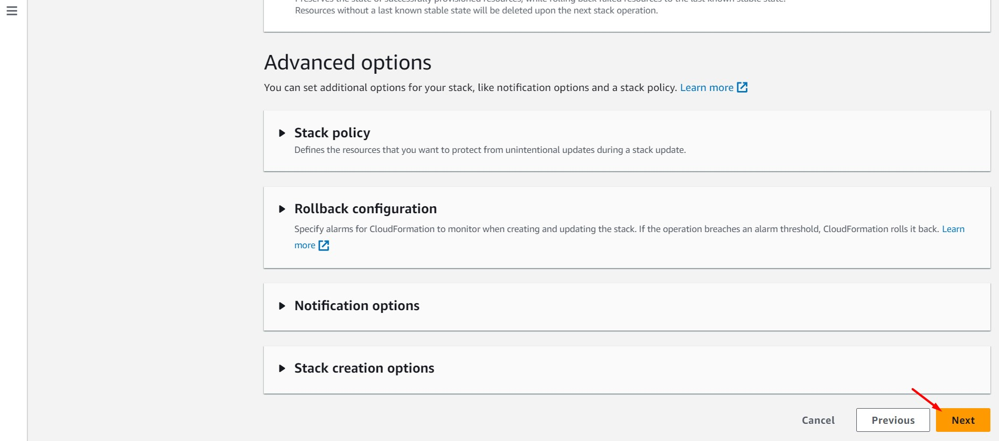
<br>

6. Dejamos los valores por defecto, seleccionamos el campo "I acknowledge that AWS CloudFormation might create IAM resources with custom names" y damos clic en el botón "Submit"

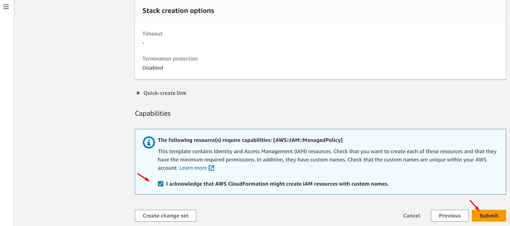
<br>

7. Esperamos que el "Stack" lanzado desde CloudFormation, cambie su estado a "CREATE_COMPLETE"


<br>


<br>

8. El Stack de CloudFormation habrá generado los siguientes componentes:


<br>


### B - Interactuar con las APIs de AWS
<br>

#### B.1 - Interactuar con las APIs de AWS desde la consola - Creando una instancia EC2
<br>

9. Desde la consola, accedemos al servicio EC2, opción "Instances", opción "Launch Instances"

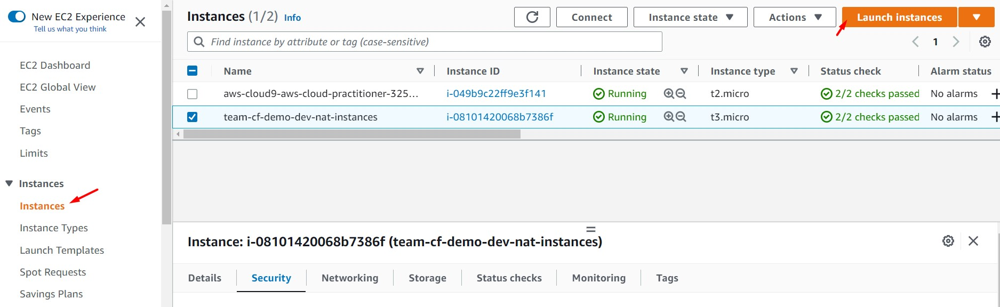
<br>

11. Ingresamos o seleccionamos los siguientes valores. Al finalizar, dar clic en el botón "Launch Instances"

    * Name: team-cf-demo-dev-ec2-console
    * Application and OS Images (Amazon Machine Image): Ubuntu Server 18.04 LTS (HVM), SSD Volume Type
    * Instance Type: t2.micro
    * Key Pair: cloud-practitioner (Generada en el paso 01)
    * Network Settings:
        * VPC: team-cf-demo-dev-vpc
        * Subnet: team-cf-demo-dev-subnet-private-a
        * Firewall (security groups): lab07-vpc-EC2SecurityGroupInstances
    * Configure Storage: Valor por defecto
    * Advanced details:
        * IAM instance profile: team-cf-demo-dev-iprofile

<br>
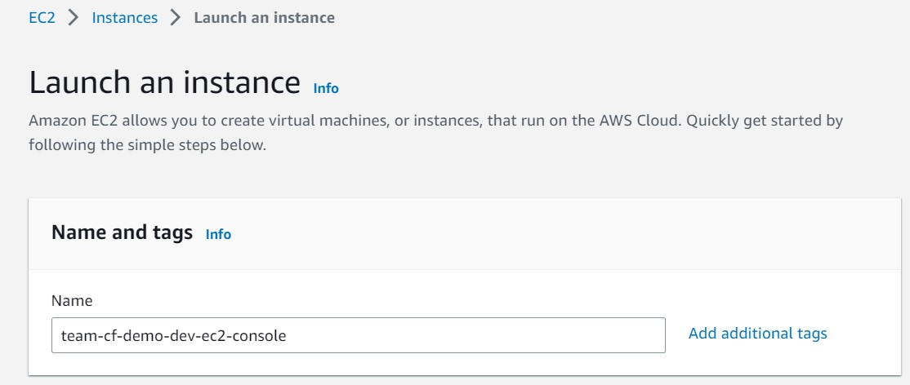
<br>

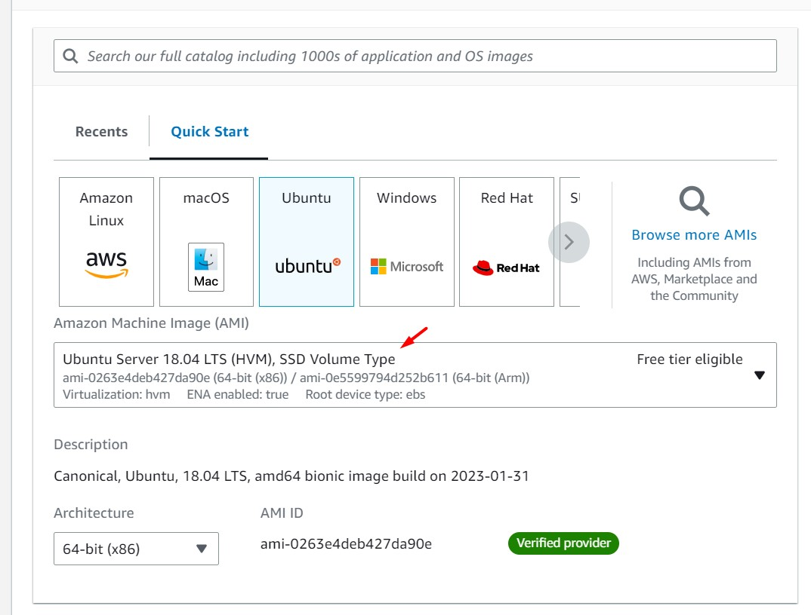
<br>

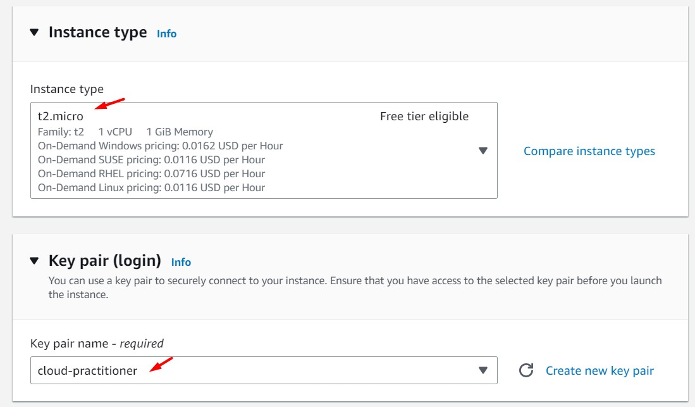
<br>


<br>

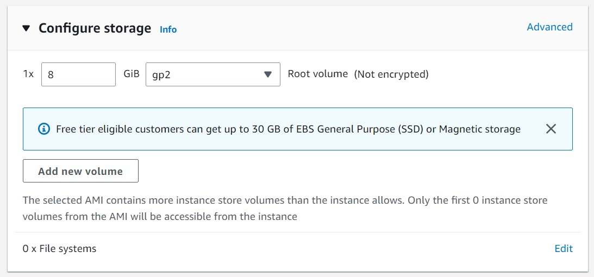
<br>

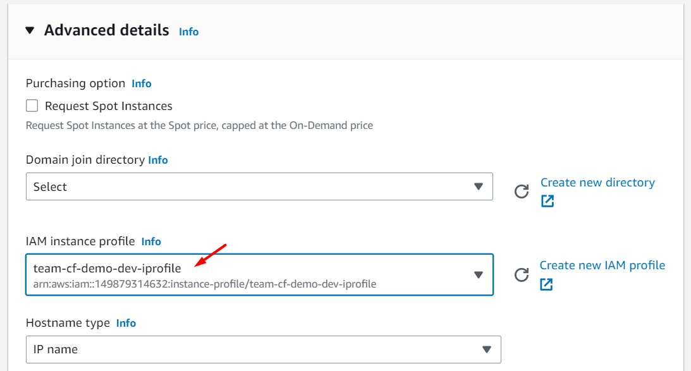
<br>


#### B.2 - Interactuar con las APIs de AWS desde AWSCLI - Creando una instancia EC2

<br>

12. Ingresamos a la instancia "team-cf-demo-dev-tool" usando el servicio de "System Manager - Session Manager", considerando los siguientes pasos:
    * Clic derecho, clic en "Connect"
    * Ingresamos a la opción "Session Manager", clic en "Connect"
    * Desde la consola, elevamos privilegios con "sudo su"

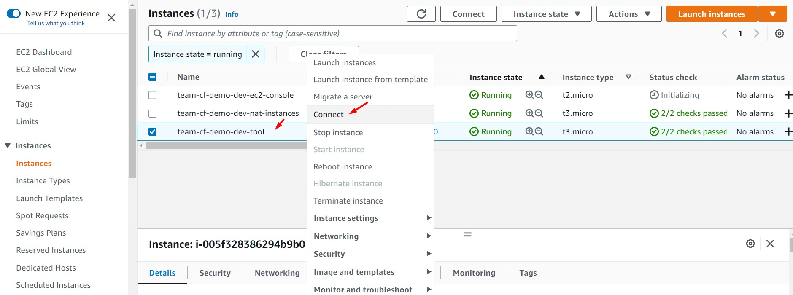
<br>

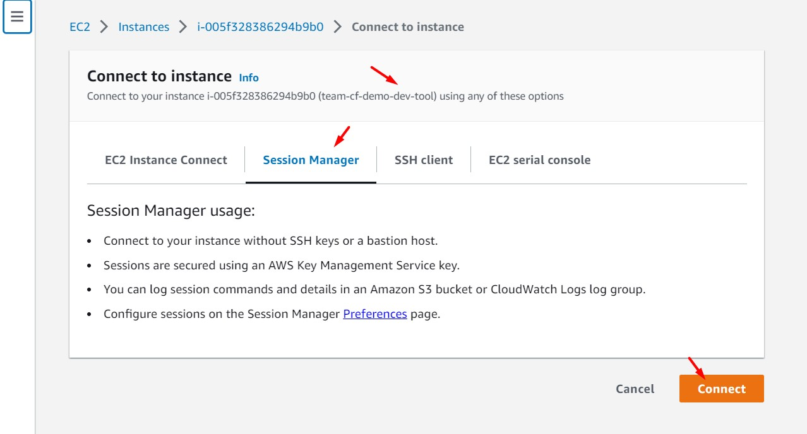
<br>

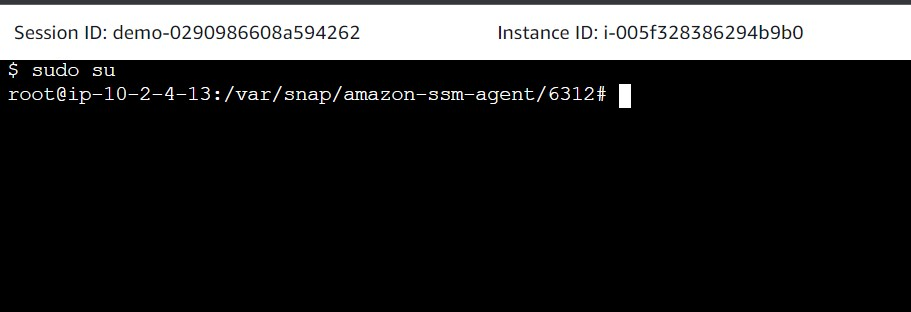
<br>


13. Desde comandos Linux, instalamos AWSCLI

```bash
sudo apt-get update
sudo apt-get install awscli -y
aws --version
```

14. El objetivo de los siguientes pasos es crear una instancia EC2 desde AWSCLI con las mismas configuraciones que la instancia EC2 creada desde la consola. Consideraciones:
    * La instancia EC2 creada desde la consola tiene asociado un "IAM Role", este "IAM Role" permite poder conectarnos vía remota a través de System Manager
    * A nivel de AWSCLI no es posible asociar un "IAM Role" directamente a un "EC2 Instances", es necesario crear un "Instances Profile" en el medio. 
    * Esto no significa que la consola no use un "Instances Profile" sino que la consola crea y asocia un "Instances Profile por nosotros"
    * Los siguientes comandos describen la creación y asociación de un "Instances Profile" desde AWSCLI.

```bash
#Creación de Instance Profile desde AWSCLI
aws iam create-instance-profile --instance-profile-name dev-ec2

#Resultado
{
    "InstanceProfile": {
        "Path": "/",
        "InstanceProfileName": "dev-ec2",
        "InstanceProfileId": "AIPASFZMA3DEGZUHKP3G5",
        "Arn": "arn:aws:iam::XXXXXXXXXXXX:instance-profile/dev-ec2",
        "CreateDate": "XXXX-XX-XXTXX:XX:XXZ",
        "Roles": []
    }
}
```
<br>

```bash
#Asociación de Instancia Profile y IAM Role desde AWSCLI
aws iam add-role-to-instance-profile \
    --instance-profile-name dev-ec2 \
    --role-name team-cf-demo-dev-role-ssm 
```

<br>

15. Ejecutamos el siguiente comando que tiene por objetivo la creación de una instancia EC2 usando parámetros personalizados. Se considera un plantilla con variables y un ejemplo  

```bash
#Plantilla
aws ec2 run-instances \
--count 1 \
--image-id ami-0263e4deb427da90e \
--instance-type t2.micro \
--subnet-id $SUBNET_ID \
--security-group-ids $SECURITY_GROUP_ID \
--key-name cloud-practitioner \
--iam-instance-profile Name="dev-ec2" \
--region us-east-1 \
--tag-specifications 'ResourceType=instance,Tags=[{Key=Name,Value=team-cf-demo-dev-ec2-awscli}]'
```
<br>

```bash
#Ejemplo
aws ec2 run-instances \
--count 1 \
--image-id ami-0263e4deb427da90e \
--instance-type t2.micro \
--subnet-id subnet-0a1ce4ea4d18d6608 \
--security-group-ids sg-031663c57114c0453 \
--key-name cloud-practitioner \
--iam-instance-profile Name="dev-ec2" \
--region us-east-1 \
--tag-specifications 'ResourceType=instance,Tags=[{Key=Name,Value=team-cf-demo-dev-ec2-awscli}]'

#Resultado
{
    "Groups": [],
    "Instances": [
        {
            "AmiLaunchIndex": 0,
            "ImageId": "ami-0263e4deb427da90e",
            "InstanceId": "i-09ff4d70e59f8c5dc",
            "InstanceType": "t2.micro",
            "KeyName": "cloud-practitioner",
            "LaunchTime": "XXXX-XX-XXTXX:XX:XX.XXXZ",
            "Monitoring": {
                "State": "disabled"
            },
            "Placement": {
                "AvailabilityZone": "us-east-1a",
                "GroupName": "",
                "Tenancy": "default"
            },
            "PrivateDnsName": "ip-10-2-3-174.ec2.internal",
            "PrivateIpAddress": "10.2.3.174",
            "ProductCodes": [],
            "PublicDnsName": "",
            "State": {
                "Code": 0,
                "Name": "pending"
            },
            "StateTransitionReason": "",
            "SubnetId": "subnet-0a1ce4ea4d18d6608",
            "VpcId": "vpc-0a11c190ede34aaa8",
            "Architecture": "x86_64",
            "BlockDeviceMappings": [],
            "ClientToken": "ce678037-0f34-42f5-b002-34762b91936b",
            "EbsOptimized": false,
            "EnaSupport": true,
            "Hypervisor": "xen",
            "IamInstanceProfile": {
                "Arn": "arn:aws:iam::XXXXXXXXXXXX:instance-profile/dev-ec2",
                "Id": "AIPASFZMA3DEGZUHKP3G5"
            },
            "NetworkInterfaces": [
                {
                    "Attachment": {
                        "AttachTime": "XXXX-XX-XXTXX:XX:XX.XXXZ",
                        "AttachmentId": "eni-attach-035a7b52db4d06009",
                        "DeleteOnTermination": true,
                        "DeviceIndex": 0,
                        "Status": "attaching"
                    },
                    "Description": "",
                    "Groups": [
                        {
                            "GroupName": "lab07-vpc-ec2-EC2SecurityGroupInstances-1J5ZCVPROLSRF",
                            "GroupId": "sg-031663c57114c0453"
                        }
                    ],
                    "Ipv6Addresses": [],
                    "MacAddress": "0a:96:dc:77:7c:77",
                    "NetworkInterfaceId": "eni-0392b8d1232406331",
                    "OwnerId": "149879314632",
                    "PrivateDnsName": "ip-10-2-3-174.ec2.internal",
                    "PrivateIpAddress": "10.2.3.174",
                    "PrivateIpAddresses": [
                        {
                            "Primary": true,
                            "PrivateDnsName": "ip-10-2-3-174.ec2.internal",
                            "PrivateIpAddress": "10.2.3.174"
                        }
                    ],
                    "SourceDestCheck": true,
                    "Status": "in-use",
                    "SubnetId": "subnet-0a1ce4ea4d18d6608",
                    "VpcId": "vpc-0a11c190ede34aaa8",
                    "InterfaceType": "interface"
                }
            ],
            "RootDeviceName": "/dev/sda1",
            "RootDeviceType": "ebs",
            "SecurityGroups": [
                {
                    "GroupName": "lab07-vpc-ec2-EC2SecurityGroupInstances-1J5ZCVPROLSRF",
                    "GroupId": "sg-031663c57114c0453"
                }
            ],
            "SourceDestCheck": true,
            "StateReason": {
                "Code": "pending",
                "Message": "pending"
            },
            "Tags": [
                {
                    "Key": "Name",
                    "Value": "team-cf-demo-dev-ec2-awscli"
                }
            ],
            "VirtualizationType": "hvm",
            "CpuOptions": {
                "CoreCount": 1,
                "ThreadsPerCore": 1
            },
            "CapacityReservationSpecification": {
                "CapacityReservationPreference": "open"
            },
            "MetadataOptions": {
                "State": "pending",
                "HttpTokens": "optional",
                "HttpPutResponseHopLimit": 1,
                "HttpEndpoint": "enabled"
            }
        }
    ],
    "OwnerId": "XXXXXXXXXXXX",
    "ReservationId": "r-0f66676e5af633977"
}
```

<br>

16. Referencia "AWSCLI para ec2.run-instances": https://docs.aws.amazon.com/cli/latest/reference/ec2/run-instances.html

<br>

#### B.3 - Interactuar con las APIs de AWS desde CloudFormation (Infraestructura como código) - Creando una instancia EC2

<br>

17. Desde la terminal, ejecutar los siguientes comandos. 

```bash
#Ubuntu 18.04
cd /home/ubuntu
git clone https://github.com/jbarreto7991/aws-cloudpractitioner.git
```
<br>

18. Generaremos una instancia EC2 con valores personalizados a través del despliegue de un template de CloudFormation. Reemplazar los valores solicitados y ejecutar el siguiente comando:
    * ImageId
    * KeyPair
    * SecurityGroupId
    * SubnetId

```bash
#Ejecución de Comando
aws cloudformation create-stack --stack-name lab07-ec2-cloudformation --template-body file:///home/ubuntu/aws-cloudpractitioner/Lab-07/code/2_lab07-ec2-cloudformation.yaml --parameters ParameterKey=ImageId,ParameterValue="ami-0263e4deb427da90e" ParameterKey=InstancesProfile,ParameterValue="dev-ec2" ParameterKey=KeyPair,ParameterValue="cloud-practitioner" ParameterKey=SecurityGroupId,ParameterValue="sg-031663c57114c0453" ParameterKey=SubnetId,ParameterValue="subnet-0a1ce4ea4d18d6608" --region us-east-1

#Resultado
{
    "StackId": "arn:aws:cloudformation:us-east-1:XXXXXXXXXXXX:stack/lab07-ec2-cloudformation/a683e190-ba0f-11ed-82c9-0a4f3e8d015b"
}
```
<br>

#### B.4 - Interactuar con las APIs de AWS desde SDK (Boto3 - Python) - Creando una instancia EC2

<br>

19. Desde el sistema operativo, ejecutamos los siguientes comandos. Procedemos a instalar "pip3" y la librería "boto3"

```bash
python3 --version
sudo apt-get install software-properties-common
sudo apt-add-repository universe
sudo apt-get update
sudo apt-get install python3-pip -y
pip3 --version
pip3 install boto3
```

<br>

20. Ejecutamos python3 y los siguientes comandos. Usar la plantilla y reemplazar las variables KEY_NAME, SECURITY_GROUPS_ID y SUBNET_ID

```bash
python3
```

```bash
#Ejecutar los siguientes comandos desde la terminal de Python
import boto3
ec2_client = boto3.client('ec2',region_name='us-east-1')

#Plantilla
response = ec2_client.run_instances(
    ImageId='ami-0263e4deb427da90e',
    InstanceType='t2.micro',
    KeyName='{$KEY_NAME}',
    MaxCount=1,
    MinCount=1,
    SecurityGroupIds=[
        '{$SECURITY_GROUPS_ID}',
    ],
    SubnetId='{SUBNET_ID}',
    IamInstanceProfile={
        'Name': 'dev-ec2'
    },
    TagSpecifications=[
        {
            'ResourceType': 'instance',
            'Tags': [
                {
                    'Key': 'Name',
                    'Value': 'team-cf-demo-dev-ec2-sdk-boto3'
                }
            ]
        }
    ]
)

#Ejemplo
response = ec2_client.run_instances(
    ImageId='ami-0263e4deb427da90e',
    InstanceType='t2.micro',
    KeyName='cloud-practitioner',
    MaxCount=1,
    MinCount=1,
    SecurityGroupIds=[
        'sg-0fd4afd89697e32e1',
    ],
    SubnetId='subnet-005b0d4452cb3f856',
    IamInstanceProfile={
        'Name': 'dev-ec2'
    },
    TagSpecifications=[
        {
            'ResourceType': 'instance',
            'Tags': [
                {
                    'Key': 'Name',
                    'Value': 'team-cf-demo-dev-ec2-sdk-boto3'
                }
            ]
        }
    ]
)
```

<br>

21. Referencia "AWSCLI para ec2.run-instances": https://boto3.amazonaws.com/v1/documentation/api/latest/reference/services/ec2/client/run_instances.html 

<br>


---

### Eliminación de recursos creados
<br>

```bash
#ELIMINACIÓN DE PLANTILLAS CLOUDFORMATION

#1. Eliminar Stack "lab07-ec2-cloudformation"
aws cloudformation delete-stack --stack-name lab07-ec2-cloudformation

#2. Eliminamos las instancias EC2 creadas desde la consola, AWSCLI y el SDK (Boto3)

#3. 76Eliminar Stack "lab07-vpc-ec2"
aws cloudformation delete-stack --stack-name lab07-vpc-ec2
```