# AWS Cloud Practitioner - Laboratorio 08

### Objetivo: 
* Despliegue de una función Lambda usando Python y variables de entorno

---

### A - Despliegue de una función Lambda usando Python y variables de entorno
<br>

1. Generar una llave KeyPair "cloud-practitioner" o tener disponible una. De no contar con una llave, acceder al servicio EC2 y luego a la opción "Key Pair". Generar llave seleccionando "RSA" y ".pem" 

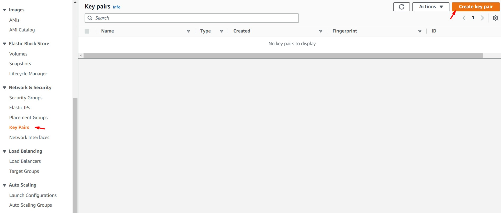
<br>

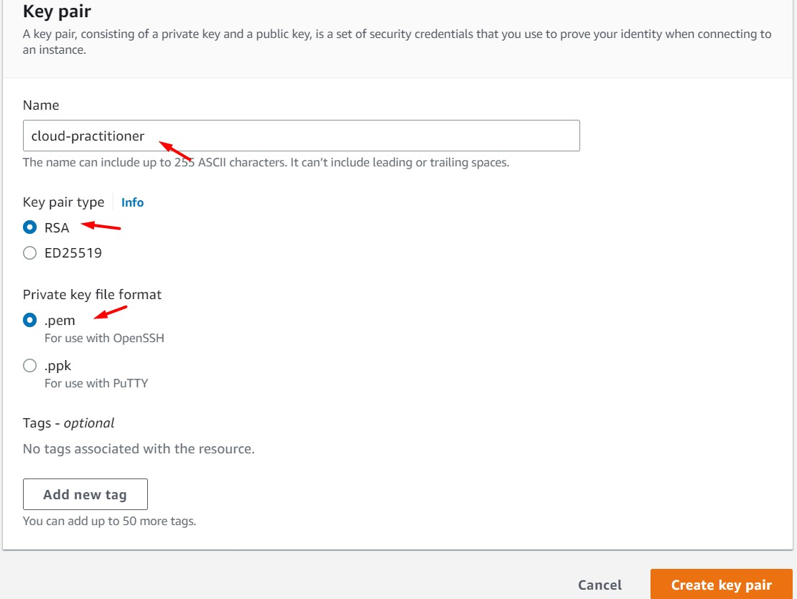
<br>

2. Acceder al servicio "AWS Lambda" y dar clic en el botón "Create Function"

<br>

3. Ingresamos o seleccionamos los siguientes valores. Al finalizar, dar clic en el botón "Create Function"

    * Function name: team-cf-demo-dev-lambda-ec2-deploy
    * Runtime: python3.9
    * Architecture: x86_64
    * Permissions: Create a new role with basic Lambda permissions

<br>
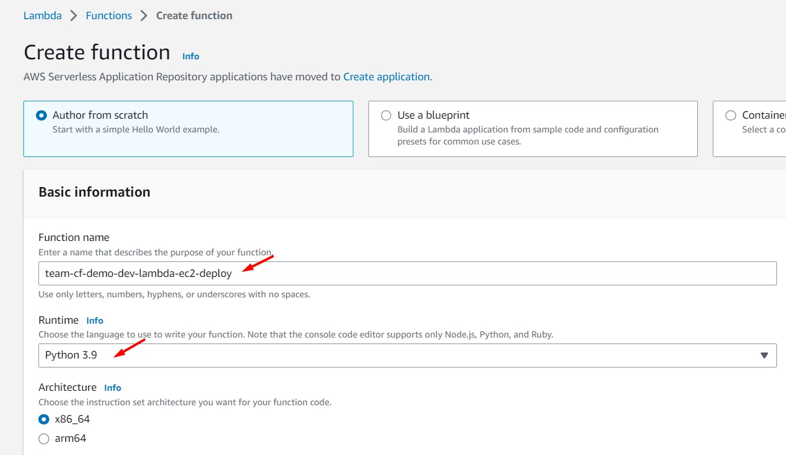
<br>

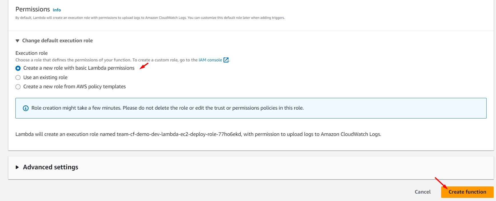
<br>

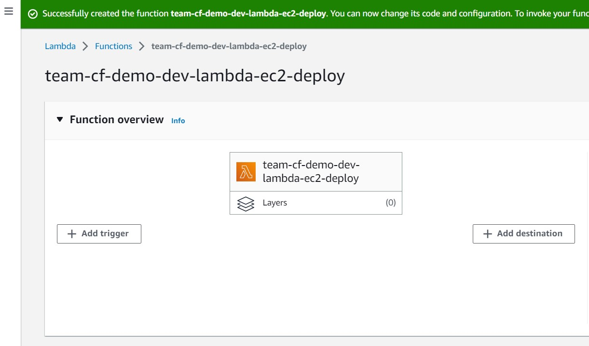
<br>

4. Copiamos el siguiente código python en nuestra función Lambda (lambda_function.py)

```bash
import boto3
import os
 
ec2 = boto3.resource('ec2')

def lambda_handler(event, context):
    
    subnet_id = os.environ['SubnetId']
    image_id = os.environ['ImageId']
    instance_type = os.environ['InstanceType']
    key_name = os.environ['KeyName']

    # Create security group
    security_group = ec2.create_security_group(
        GroupName='Lab08-MySecurityGroup',
        Description='Lab08 My security group from Python'
    )
    
    # Add inbound rule to security group
    security_group.authorize_ingress(
        IpPermissions=[
            {
                'IpProtocol': 'tcp',
                'FromPort': 22,
                'ToPort': 22,
                'IpRanges': [{'CidrIp': '0.0.0.0/0'}]
            }
        ]
    )
    
    # Launch EC2 instance
    instances = ec2.create_instances(
        ImageId=image_id,
        InstanceType=instance_type,
        KeyName=key_name,
        MinCount=1,
        MaxCount=1,
        NetworkInterfaces=[
            {
                'SubnetId': subnet_id,
                'DeviceIndex': 0,
                'AssociatePublicIpAddress': True,
                'Groups': [security_group.group_id]
            }
        ],
        TagSpecifications=[
            {
                'ResourceType': 'instance',
                'Tags': [
                    {
                        'Key': 'Name',
                        'Value': 'team-cf-demo-dev-lambda-ec2-deploy'
                    }
                ]
            }
        ]
    )
    
    return {
        'statusCode': 200,
        'body': 'Instance launched'
    }
```

<br>

5. Desde la función Lambda dar clic en la opción "Configuration", luego en la opción "Enviroment variables" y luego clic en "Edit" con el objetivo de generar variables de entorno.

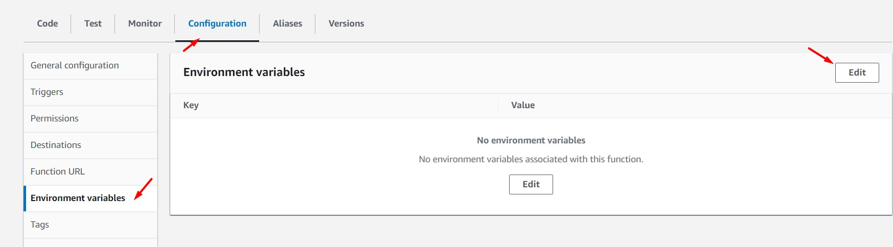
<br>

6. A través de la opción "Add Enviroment Variable", generamos las siguientes variables de entorno: ImageId, InstanceType, SubnetId, KeyName.

    * ImageId: ami-0263e4deb427da90e
    * InstanceType: t2.micro
    * SubnetId: Validar valor de SubnetId a través del servicio VPC
    * KeyName: Validar nombre de llave definida en el punto 1

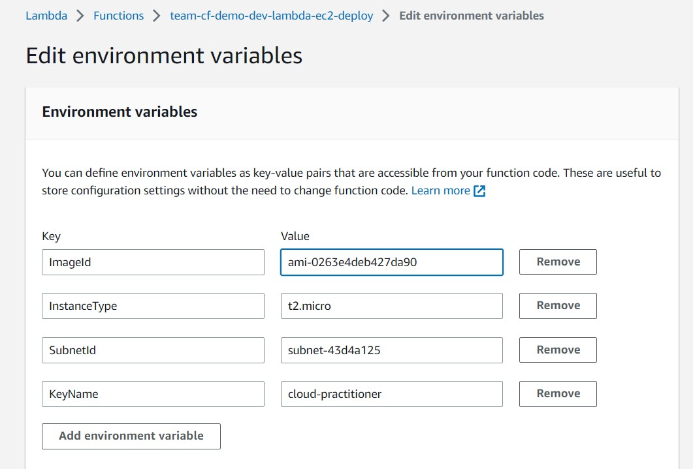
<br>

7. Es hora de testear nuestra función! Desde la opción "Code", dar clic en el botón "Test". Debido a que no contamos con un evento de test creado, aparecerá una nueva ventana. Ingresar un nombre aleatorio en la sección "Event Name" (p.ej. MyEventName) y dar clic en el botón "Save"

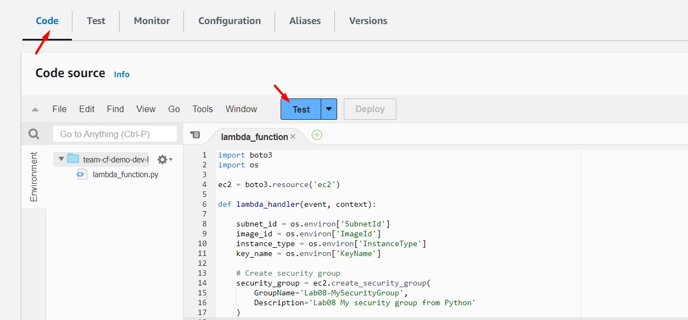
<br>

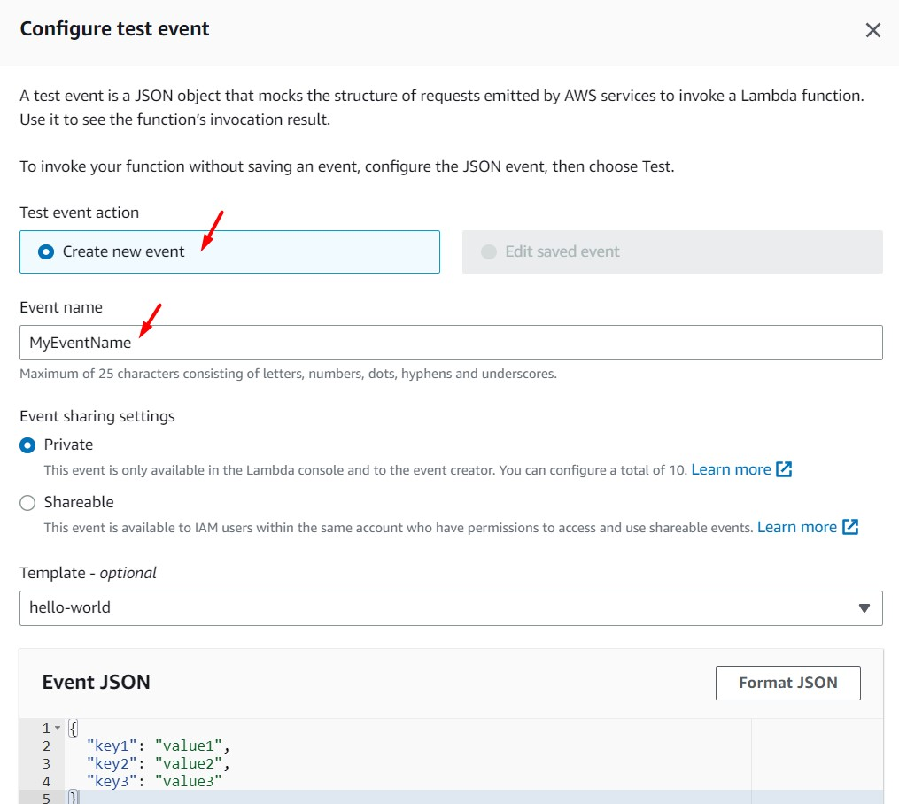
<br>

8. Dar clic nuevamente sobre el botón "Test". Aparecerá el siguiente error. Esto se debe a la falta de permisos asociados al rol asociado a Lambda.

```
{
  "errorMessage": "An error occurred (UnauthorizedOperation) when calling the CreateSecurityGroup operation: You are not authorized to perform this operation. Encoded authorization failure message: uHBgTq6oRULuxdrPFoe9CBCuvzK-XTxEBwZxtCJ7wqxLBIHZI1izBuXd3RFDUoizUkf5aoaAmpZ9EO6qE6xpUU1aSc76h3oQHmY9rTS_9mrKF4WQnN8jCc95hhK_dREhyC4dLaVzEWSikj78AURv10F2jY4YbLJMbgDjnrA_26Rbvv3mUgnZeu8kIlVKlaL_0BbCiBTd_ieBUC7DrUDxETbZ63Ub3GGxXRtaTRWypifnTf9IZZ9e-5YMfRew4Ww0g2HJleGb0QjCfm053-FLWp2mLSww_iy-4co4Rp_R2PL_JAmP5zVgRy4L0SVUSYMlK6dv2DBDIMVBMvl1mVfh1BkC4o5uAFtuTnVn2NOONqhhoz0uc8Rv-RM-t4ONOxhjIm_MdOkLjh1b_sPmJvhpJeUeZ76rgL11B5J-qvFvjqvjySxcukBUCRmZ5AQjbWq0chUhI32mMv7tvIDDU8RsOILvNw97j71l5m7tBHR3FpkTyTR6Uky6_W5MdYOlSVOy3_ItJRK-8wouhRfRQX5pFO7C6FPJUHuEHDXiTlET84P8QyWpoCguGHZmM5Z8Uw",
  "errorType": "ClientError",
  "requestId": "f01ba0d1-ab9e-4d95-97f7-26a668f6372d",
  "stackTrace": [
    "  File \"/var/task/lambda_function.py\", line 14, in lambda_handler\n    security_group = ec2.create_security_group(\n",
    "  File \"/var/runtime/boto3/resources/factory.py\", line 520, in do_action\n    response = action(self, *args, **kwargs)\n",
    "  File \"/var/runtime/boto3/resources/action.py\", line 83, in __call__\n    response = getattr(parent.meta.client, operation_name)(*args, **params)\n",
    "  File \"/var/runtime/botocore/client.py\", line 391, in _api_call\n    return self._make_api_call(operation_name, kwargs)\n",
    "  File \"/var/runtime/botocore/client.py\", line 719, in _make_api_call\n    raise error_class(parsed_response, operation_name)\n"
  ]
}
```

<br>

9. Accedemos a la opción "Configuration", luego a la opción "Permissions" y damos clic sobre el valor del campo "Role name". 

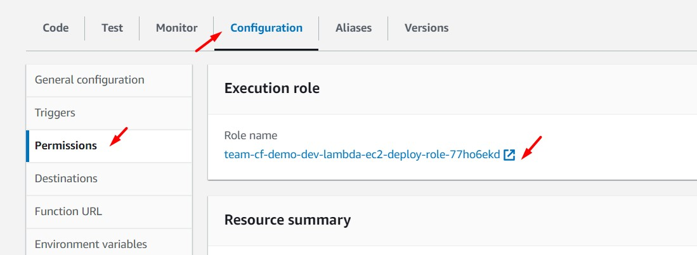
<br>

10. El enlace nos ha direccionado al servicio IAM (Identity and Access Manager) y a la opción "Roles - Permissions". Damos clic sobre el botón "Add permissions" y luego sobre "Attach policies". Buscamos la política administrada por AWS "AdministratorAccess", la seleccionamos y damos clic sobre el botón "Add permissions".  

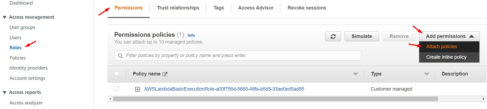
<br>

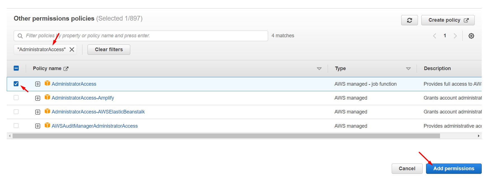
<br>

11. Ejecutamos nuevamente nuestra función Lambda. Y validamos la creación de nuestra nueva instancia EC2 

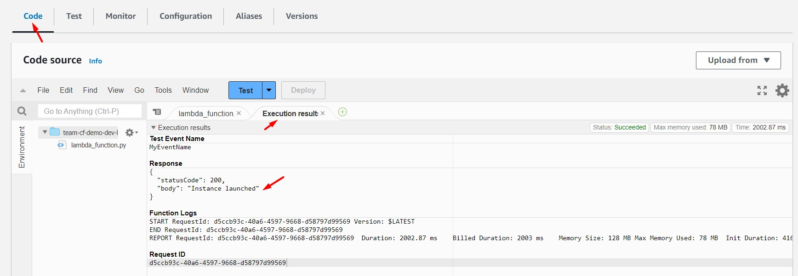
<br>

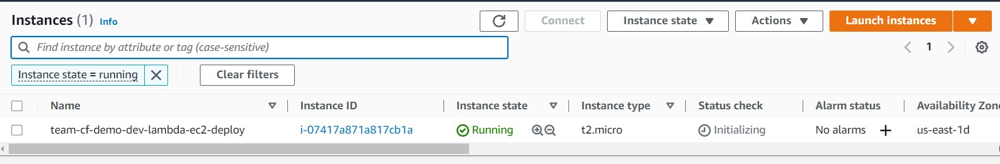
<br>

---

### Eliminación de recursos creados
<br>

1. Eliminación de instancia EC2 "team-cf-demo-dev-lambda-ec2-deploy"
2. Eliminación de función Lambda "team-cf-demo-dev-lambda-ec2-deploy"
3. Eliminación de IAM Role "team-cf-demo-dev-lambda-ec2-deploy-role"
4. Eliminación de Security Group "Lab08-MySecurityGroup"