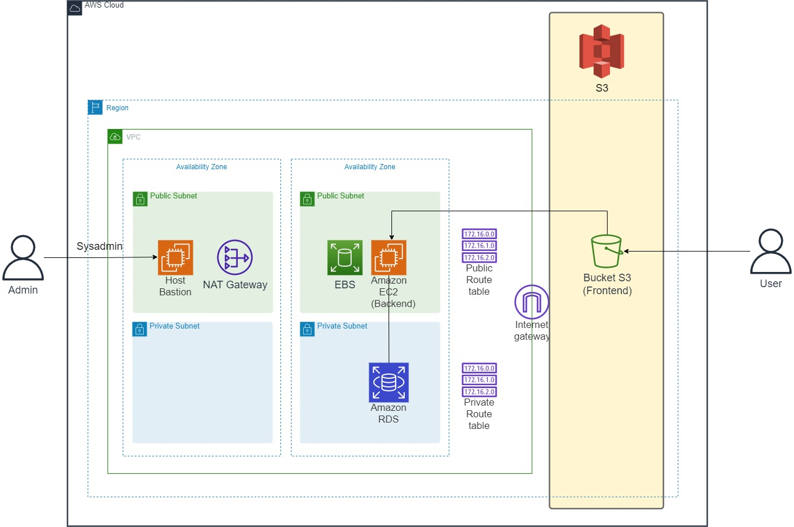
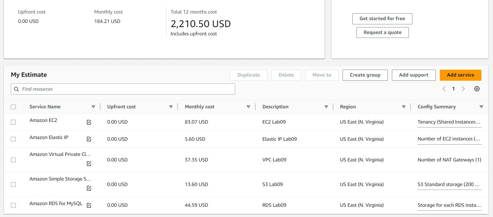

# AWS Cloud Practitioner - Laboratorio 09

### Objetivo: 
* Estimación de costos en AWS usando la calculadora

---

### A - Estimación de costos en AWS usando la calculadora

 

1. Estimar la siguiente solución, considerando el siguiente detalle:

    * **Estimación de Instancias EC2**
        * Region: N. Virginia
        * Tenancy: Shared Instances
        * OS: Ubuntu 18.04 LTS
        * Workloads: Constant usage
        * Instances: t3.medium
        * Payment Option: On-Demand
            * Usage: 8
            * Usage Type: Hours/ Day
        * Detailed monitoring: Enable
        * Outbound Data Transfer: 100 GB per month (Internet)
        * Elastic IP: 01 per Instances

    * **Estimación de Volúmenes EBS**
        * Volume Type: gp3
        * Storage amount: 512 GB
        * Snapshot Frequency: Daily
        * Amount changed per snapshot: 10 GB

    * **Estimación de VPC (Networking)**
        * Number of NAT Gateways: 01
        * Data Processed per NAT Gateway: 100 GB per month

    * **Estimación de S3**
        * S3 Standard Storage: 200 GB
        * Outbound Data Transfer: 100 GB per month (Internet)

    * **Estimación de RDS (MySQL)**
        * Region: N. Virginia
        * Quantity: 1
        * Instances Size: db.t3.medium
        * Utilization (On-Demand only): 8 Hours/Day
        * Deployment option: Multi-AZ
        * Pricing model: On-Demand
        * RDS Proxy: No
        * Storage for each RDS instance: SSD (gp3)
        * Storage amount: 50 GB

 

https://calculator.aws/#/

 

 

2. Validación de la solución: https://calculator.aws/#/estimate?id=82ed0425c8330fc611f34c4ccb49647b65e09990

 

 

3. AWS mapea sus precios taambién, a través de la página respectiva de precio de cada servicio.

    * https://aws.amazon.com/es/ec2/pricing/on-demand/
    * https://aws.amazon.com/es/vpc/pricing/
    * https://aws.amazon.com/es/ebs/pricing/
    * https://aws.amazon.com/es/s3/pricing/
    * https://aws.amazon.com/es/rds/pricing/ 

---

### Eliminación de recursos creados
 

1. No Aplica