# AWS Cloud Practitioner - Laboratorio 09

### Objetivo: 
* Creación de una instancia EC2 Linux (Ubuntu) y un volumen EBS gp2 de 10 GB
* Instalación de apache2
* Configuración de mínimos privilegios para el security group

---

### A - Creación de una instancia EC2 Linux (Ubuntu) y volumen EBS gp2 de 10 GB

<br>

1. Accedemos al servicio EC2 desde la consola de AWS. Ingresar al features "Instances" y luego dar clic en el botón "Launch Instances"

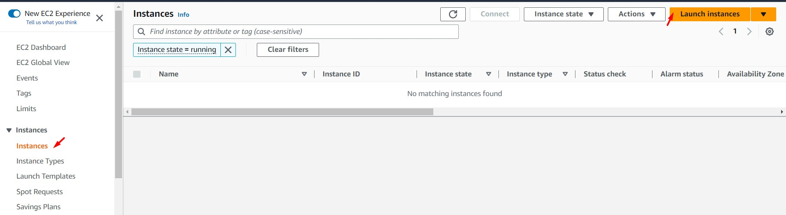
<br>

2. Ingresar/seleccionar los siguientes valores. Luego, dar clic en "Launch Instance"

    * Name and tags: Lab10-my-first-ec2
    * Application and OS Images (Amazon Machine Image): Ubuntu 18.04 LTS (HVM), SSD Volume Type
    * Instances Type: t2.micro
    * Key Pair (login): Create new key pair
        * Key pair name: aws-cloud-practitioner
        * Key pair type: RSA
        * Private key file format: .pem
    * Netwok Settings
        * Network: Default
        * Subnet: Default
        * Auto-assign public IP: Default
        * Firewall (security groups): Create security groups: Default
    * Configure storage
        * 1x 10 GB gp2 Root Volume (Not encrypted)
    * Advanced detail: Default

<br>

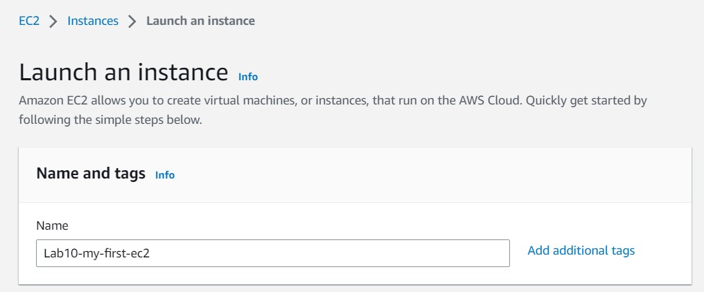
<br>


<br>

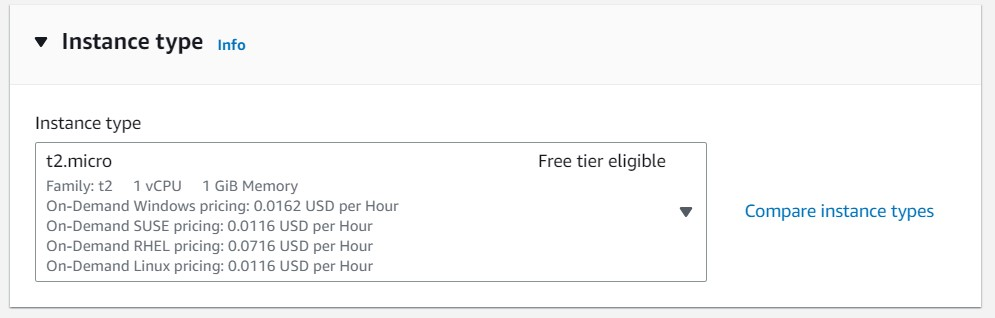
<br>

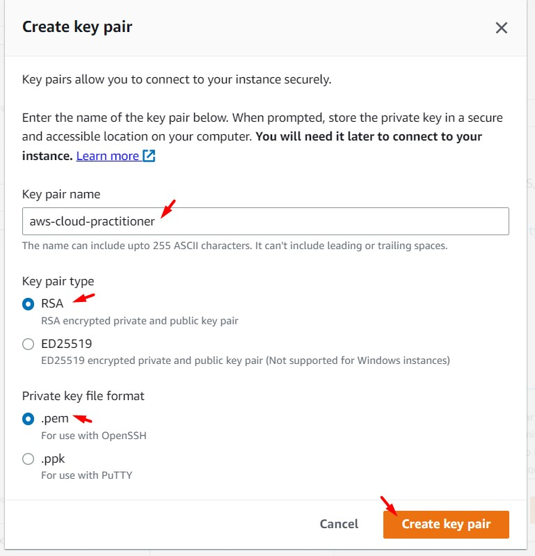
<br>

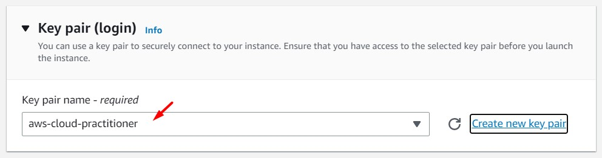
<br>

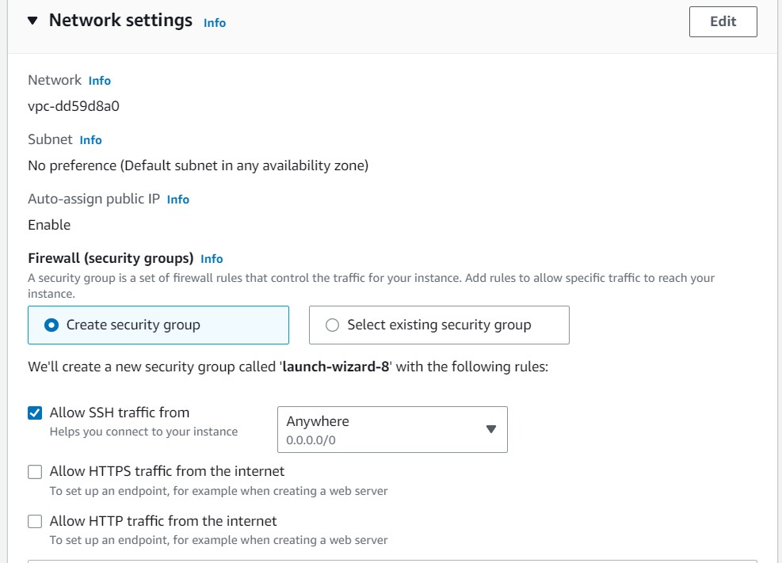
<br>

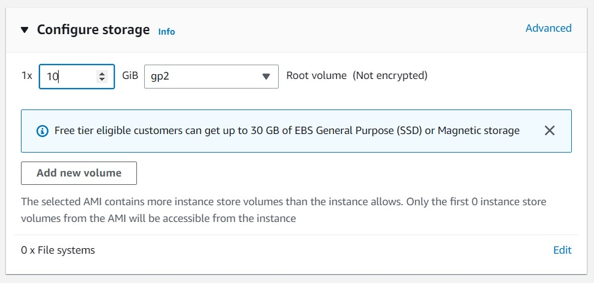
<br>

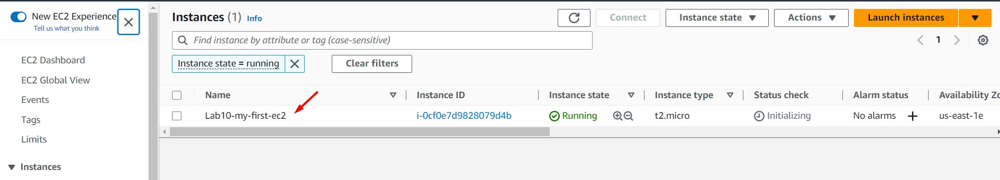
<br>


### B -Instalación de apache2

3. Usar la opción "Connect" de EC2 Instances para obtener el comando de conexión SSH de la instancia.

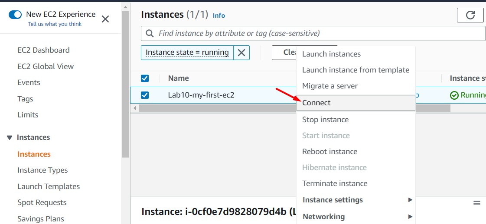
<br>

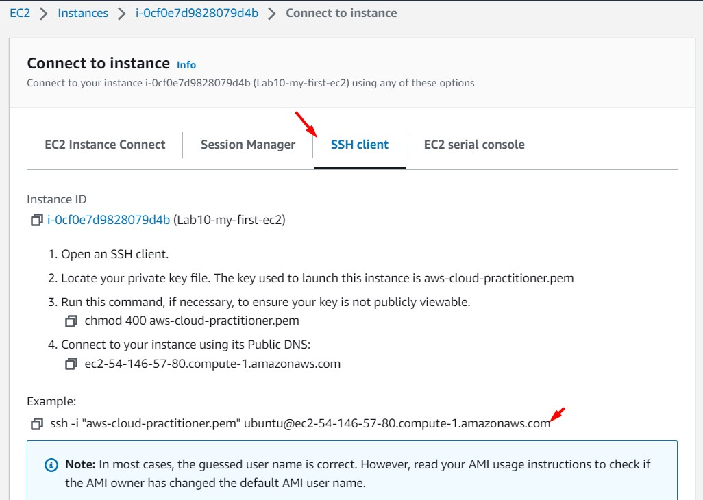
<br>

4. Abrimos nuestro terminal (p.ej. usando Visual Studio Code) y nos dirigimos al directorio donde se encuentra nuestra llave .pem. generada en pasos anteriores (p.ej. "C:\Users\Jorge\Downloads\") Ejecutamos el comando de conexión SSH obtenido en el paso anterior. Durante el proceso de conexión, aceptaremos los mensajes mostrados por la instancia EC2 (yes).

```bash
PS C:\Users\Jorge\Desktop\AWS\aws-cloudpractitioner> cd C:\Users\Jorge\Downloads\
PS C:\Users\Jorge\Downloads> ssh -i "aws-cloud-practitioner.pem" ubuntu@ec2-54-146-57-80.compute-1.amazonaws.com
The authenticity of host 'ec2-54-146-57-80.compute-1.amazonaws.com (54.146.57.80)' can't be established.
ED25519 key fingerprint is SHA256:1cBVQRfdt7qvflDZ8M2kWOvZ3f4eGPx/eaw57+z423k.
This key is not known by any other names
Are you sure you want to continue connecting (yes/no/[fingerprint])? yes
Warning: Permanently added 'ec2-54-146-57-80.compute-1.amazonaws.com' (ED25519) to the list of known hosts.
Welcome to Ubuntu 18.04.6 LTS (GNU/Linux 5.4.0-1094-aws x86_64)

 * Documentation:  https://help.ubuntu.com
 * Management:     https://landscape.canonical.com
 * Support:        https://ubuntu.com/advantage

  System information as of Thu Mar  9 04:31:00 UTC 2023

  System load:  0.0               Processes:           93
  Usage of /:   13.2% of 9.51GB   Users logged in:     0
  Memory usage: 19%               IP address for eth0: 172.31.48.252
  Swap usage:   0%

0 updates can be applied immediately.

The programs included with the Ubuntu system are free software;
the exact distribution terms for each program are described in the
individual files in /usr/share/doc/*/copyright.

Ubuntu comes with ABSOLUTELY NO WARRANTY, to the extent permitted by
applicable law.

To run a command as administrator (user "root"), use "sudo <command>".
See "man sudo_root" for details.

ubuntu@ip-172-31-48-252:~$
```
<br>

5. Una vez logueados en la instancia EC2, ejecutamos los siguientes comandos:

```bash
sudo su
sudo apt-get update
sudo apt-get install apache2 -y
```

6. Accedemos a la IP Pública de la instancia desde nuestro navegador web. Validamos que aún no es posible acceder a nuestro servicio web.

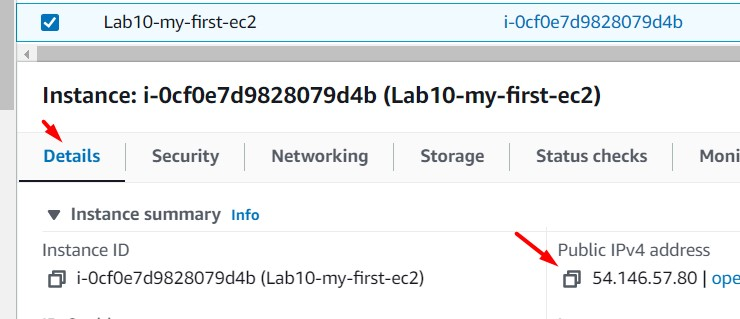
<br>


### C - Configuración de mínimos privilegios para el security group

7. Identificamos el security group asociado a nuestra instancia EC2, seleccionando la instancia EC2, dando clic en la opción "Security" y luego en el "Security Group". 

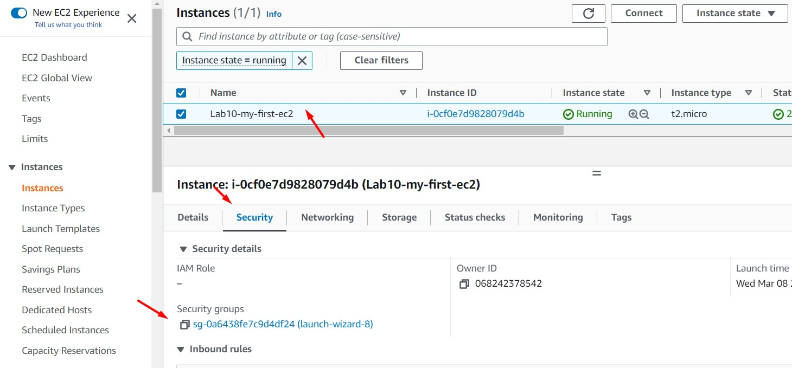
<br>

8. Seremos redireccionados a otro página. En la pestaña "Inbound rules", damos clic en el botón "Edit Inbound Rules"

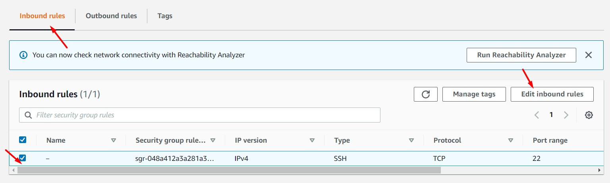
<br>

9. Eliminamos el registro mostrado y agregamos los siguientes dos registros. Al finalizar, damos clic en "Save rules". Accedemos nuevamente a la IP Pública de la instancia EC2. Podremos visualizar nuestro servicio web.

    * Type: SSH, Source: My IP
    * Type: HTTP, Source: Anywhere IPv4

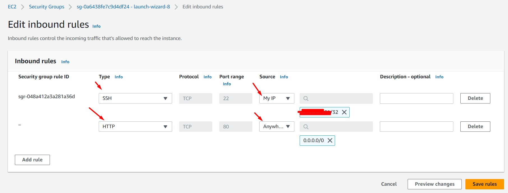
<br>

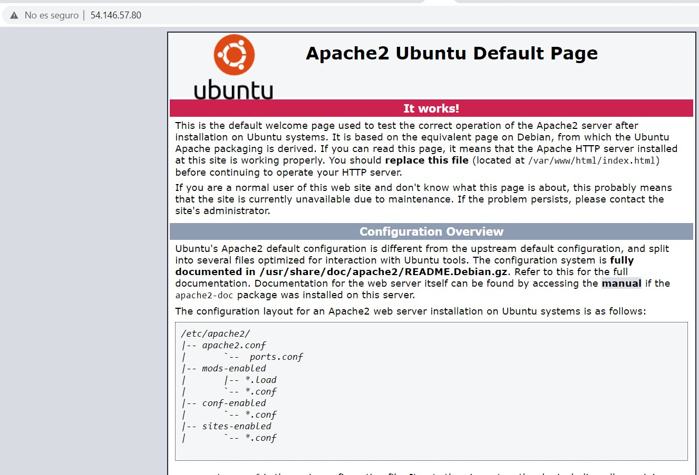
<br>

### D - Análisis

10. Analizar los siguientes componentes, según servicio:

#### **Network Services: VPC**

**VPC (Virtual Private Cloud)**
1. VPC ID
2. IPv4 CIDR

**Subnet**
1. Subnet ID
2. IPv4 CIDR
3. Availability Zone

**Internet Gateway**
1. Internet Gateway ID
2. VPC ID

**Route Table**
1. Route Table ID
2. Routes
3. Subnet Associations

<br>

#### **Compute Services: EC2**

1. Instances ID
2. Public IPv4 address
3. Private IPv4 address
4. Instance state
5. Public IPv4 hostname
6. Private IPv4 hostname
7. Instance Type
8. Subnet ID
9. AMI ID
10. Key Pair name
11. Subnet ID
12. Availability Zone
13. Network Interface ID

<br>

#### **Storage Services: EBS**

1. Volume ID
2. Type
3. Size
4. Volume State
5. IOPS
6. Throughput
7. Encryption
8. Snapshot
9. Availability Zone


---

### Eliminación de recursos creados
<br>

1. Instancia EC2 generada desde consola AWS