# AWS Cloud Practitioner - Laboratorio 11

### Objetivo: 
* Supervisión y alerta de intentos fallidos de autenticación en su cuenta de AWS usando CloudTrail, CloudWatch (Log, Filter, Alarm) y SNS

---

### A - Supervisión y alerta de intentos fallidos de autenticación en su cuenta de AWS usando CloudTrail, CloudWatch (Logs, Filter, Alarm) y SNS

<br>

1. Ingresar al servicio CloudTrail, dar clic en la opción "Trail" y luego dar clic en el botón "Create Trail"

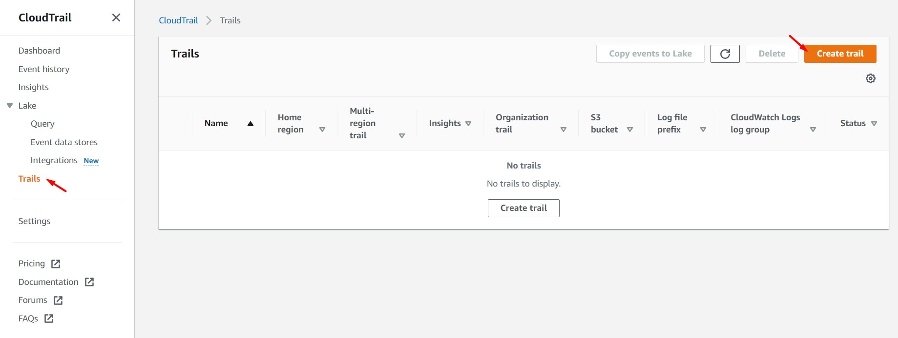
<br>

2. Ingresar/seleccionar los siguientes valores. Luego, dar clic en "Next"

    **General details**
    * Trail name: security-trail
    * Storage location: Create new S3 bucket
    * Trail log bucket and folder: Valor autogenerado por defecto
    * Log file SSE-KMS encryption Info: Deshabilitar

    **CloudWatch Logs**
    * CloudWatch Logs: Enabled
    * Log group: New
    * Log group name: security-logs
    * IAM Role: New
    * Role name: CloudTrailRoleForCloudWatchLogs_security-trail

<br>

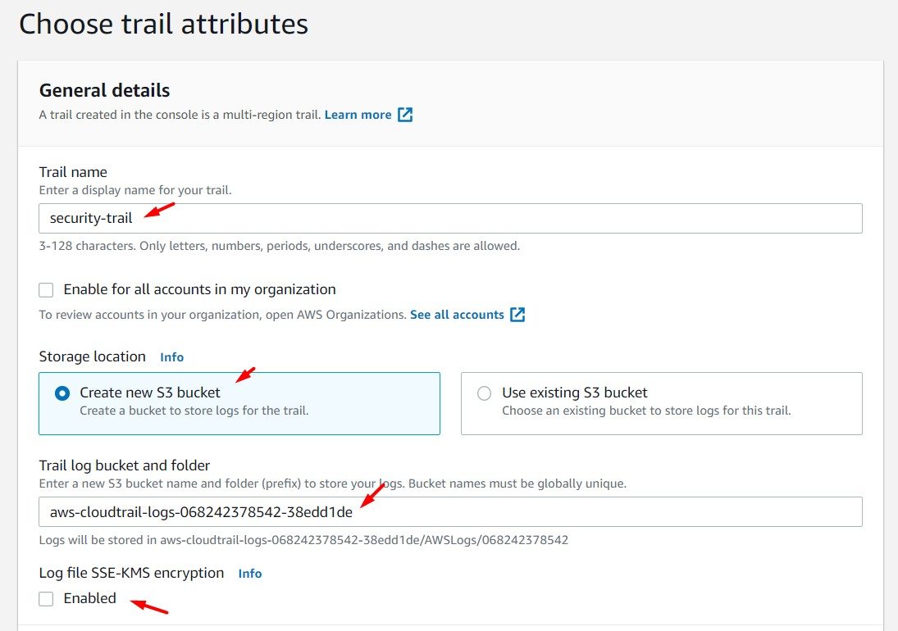
<br>

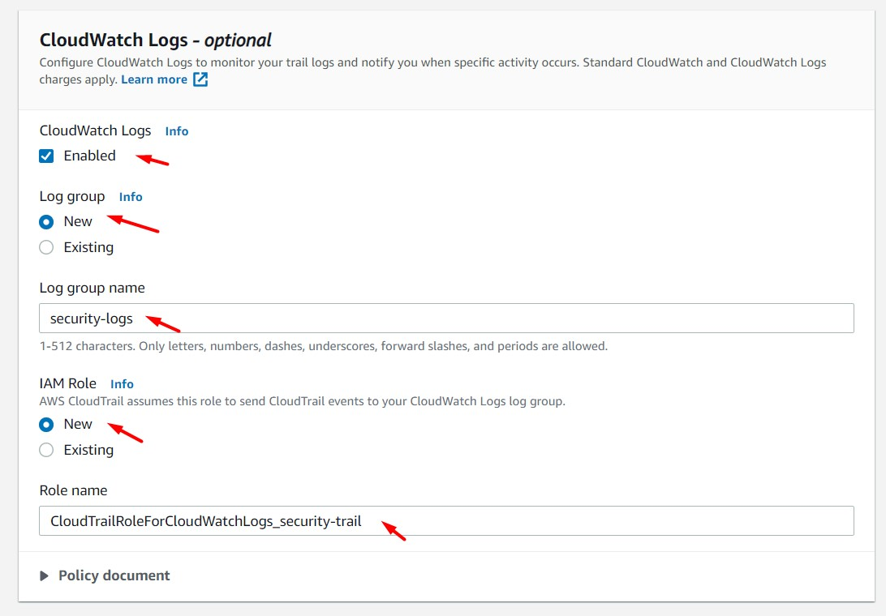
<br>

3. En las secciones "Events" y "Management events" dejar los valores por defecto. Dar clic en "Next". Luego, clic en "Create Trail"

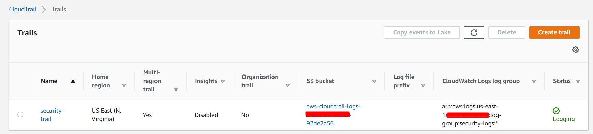
<br>

4. Desde un navegador en incógnito, ingresar a nuestra cuentas de AWS de forma fallida (contraseña o MFA incorrecto).

<br>

5. Esperar dos o tres minutos, acceder al servicio CloudTrail, opción "Event history" y buscar el nombre del evento "ConsoleLogin". Acceder al contenido del evento. Buscar el campo "errorMessage"

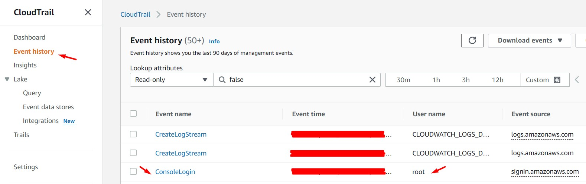
<br>

```bash
{
    "eventVersion": "1.08",
    "userIdentity": {
        "type": "Root",
        "principalId": "XXXXXXXXXXXX",
        "arn": "arn:aws:iam::XXXXXXXXXXXX:root",
        "accountId": "XXXXXXXXXXXX",
        "accessKeyId": ""
    },
    "eventTime": "XXXX-XX-XXTXX:XX:XXZ",
    "eventSource": "signin.amazonaws.com",
    "eventName": "ConsoleLogin",
    "awsRegion": "us-east-1",
    "sourceIPAddress": "XX.XX.XX.XX",
    "userAgent": "Mozilla/5.0 (Windows NT 10.0; Win64; x64) AppleWebKit/537.36 (KHTML, like Gecko) Chrome/110.0.0.0 Safari/537.36",
    "errorMessage": "Failed authentication",
    "requestParameters": null,
    "responseElements": {
        "ConsoleLogin": "Failure"
    },
    "additionalEventData": {
        "LoginTo": "https://console.aws.amazon.com/console/home?hashArgs=%23&isauthcode=true&nc2=h_ct&src=header-signin&state=hashArgsFromTB_us-east-2_XXXXXXXXXXXXXXXX",
        "MobileVersion": "No",
        "MFAUsed": "No"
    },
    "eventID": "3a6e5a26-e53f-4d01-9705-9851a1f1b7bd",
    "readOnly": false,
    "eventType": "AwsConsoleSignIn",
    "managementEvent": true,
    "recipientAccountId": "XXXXXXXXXXXX",
    "eventCategory": "Management",
    "tlsDetails": {
        "tlsVersion": "TLSv1.2",
        "cipherSuite": "ECDHE-RSA-AES128-GCM-SHA256",
        "clientProvidedHostHeader": "signin.aws.amazon.com"
    }
}
```

<br>

6. Accedemos al servicio CloudWatch, luego a la opción "Log groups" y buscamos el nombre de nuestro "Log groups", si se siguieron las indicaciones del paso 2, el nombre es "security-logs". Configurar una retención de "1 día". Al finalizar, damos clic sobre el nombre del "Log groups".

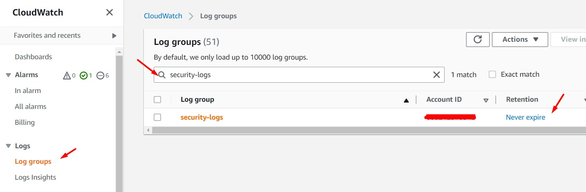
<br>

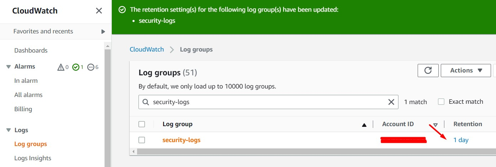
<br>

7. Dentro del "Log groups: security-logs", accedemos a la opción "Metric filters" y damos clic en el botón "Create metric filter"


<br>

8. En la sección "Create filter patter" ingresar el siguiente valor en el campo "Filter pattern". Dar clic en el botón "Next".

```bash
{$.eventSource="signin.amazonaws.com" && $.errorMessage="Failed authentication"}
```

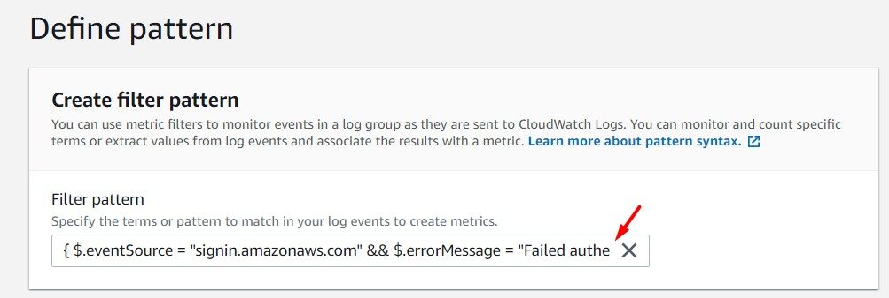
<br>

9. Ingresar/seleccionar los siguientes valores. Luego, dar clic en el botón "Next" y al botón "Create metric filter"

    * Filter name: AWSFailedAuthenticationAttempts
    * Metric namespace: AWSCloudSecurity
    * Metric name: AWSFailedAuthenticationAttempts
    * Metric value: 1

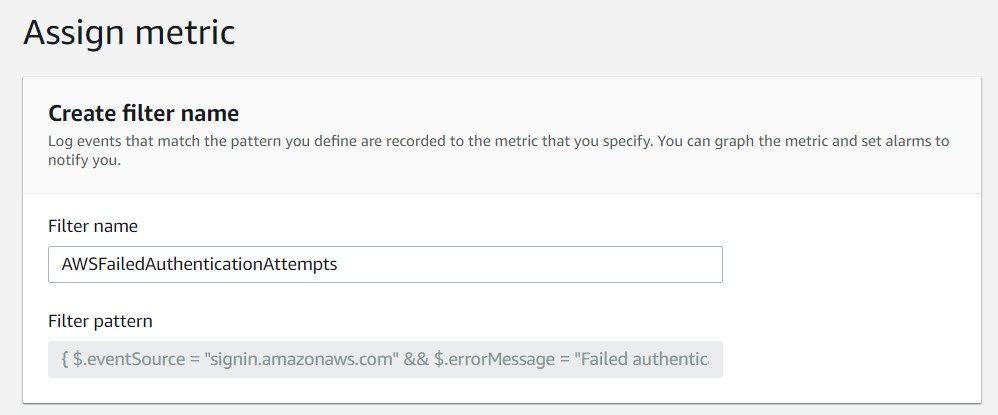
<br>

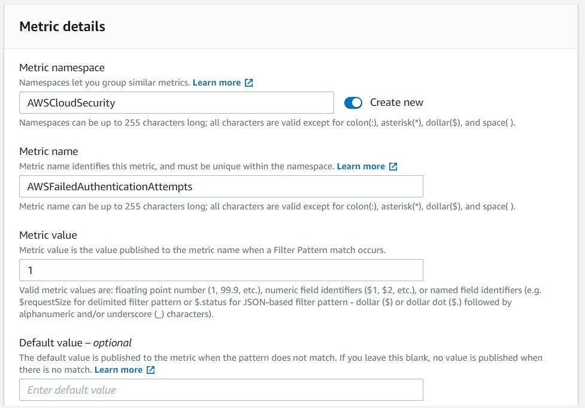
<br>

10. Desde un navegador en incógnito, ingresar a nuestra cuentas de AWS de forma fallida (contraseña o MFA incorrecto) varias veces. Esperamos unos minutos mientros los datos se refleja en "CloudWatch Metric".

<br>

11. Ingresamos al servicio "CloudWatch", opción "All Alarms", dar clic en el botón "Create alarm". Dar clic en el botón "Select metric"

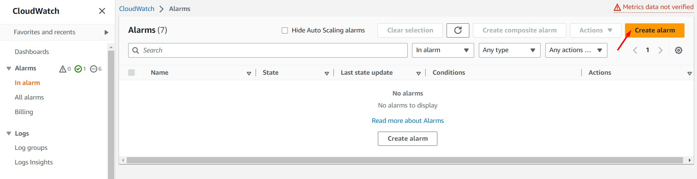
<br>

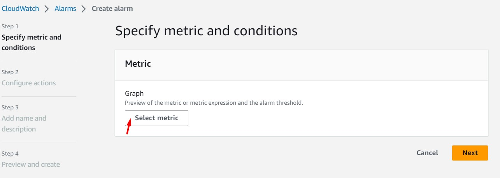
<br>

12. Buscamos el "Custom namespaces: AWSCloudSecurity" (Nombre ingresado en el paso 9). Seleccionamos "Metrics with no dimensions" y seleccionamos la métrica "AWSFailedAuthenticationAttempts". Dar clic en "Select Metric".

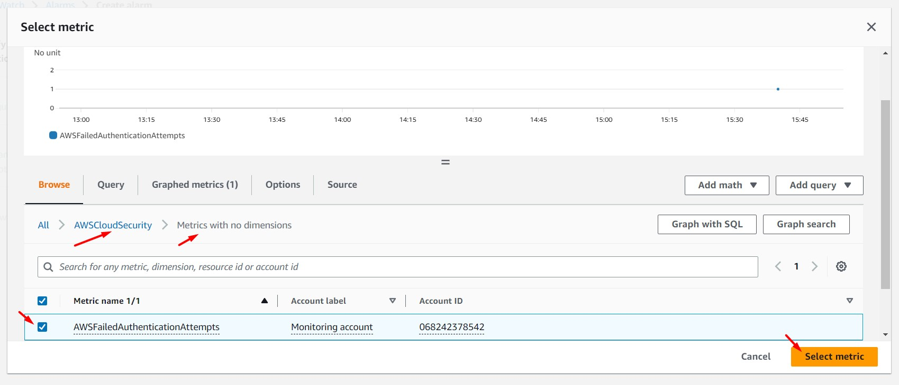
<br>

13. Ingresar/seleccionar las siguientes valores. Dar clic en el botón "Next".

    * Metric name: AWSFailedAuthenticationAttempts
    * Statistic: Average
    * Period: 1 minute
    * Threshold type: Static
    * Whenever EstimatedCharges is...: Greater/Equal
    * than…: 1
    * Datapoints to alarm: 1 out of 1
    * Missing data treatment: Treat missing data as missing

<br>
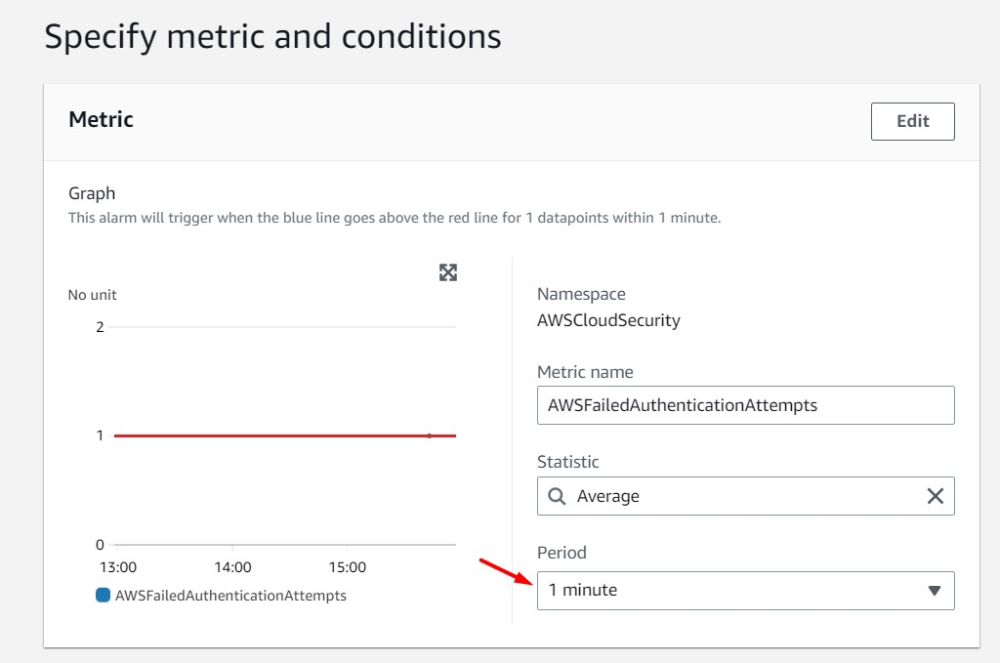
<br>
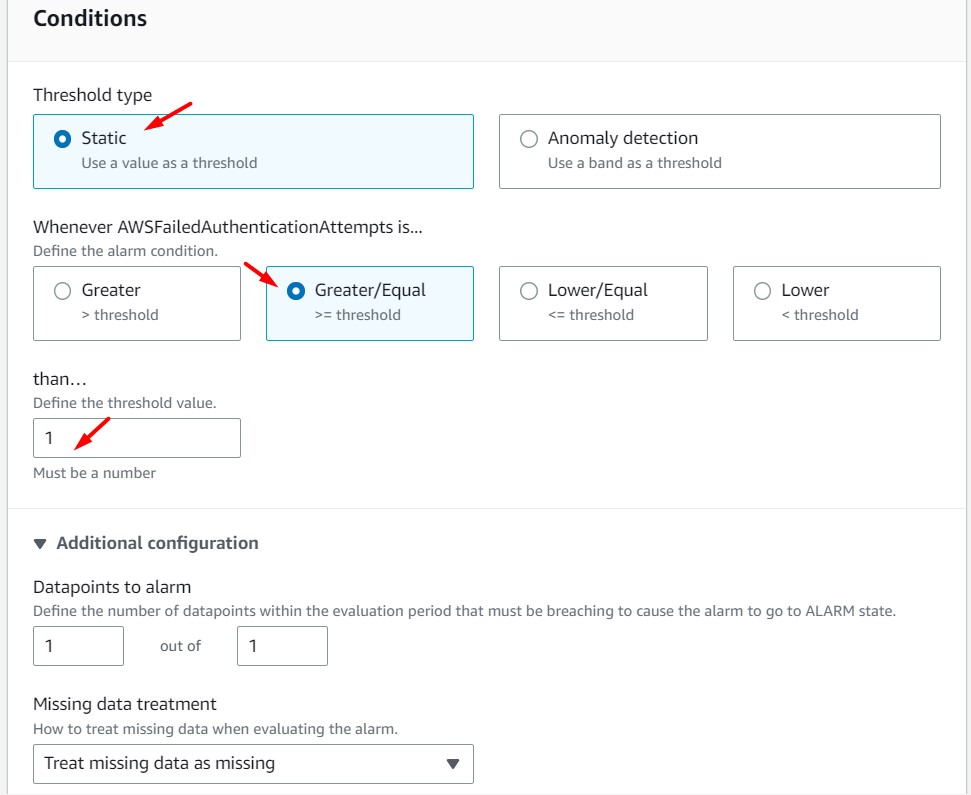
<br>

14. Dar clic en el botón "Add Notification". Seleccionar/ingresar los siguientes valores:

    * Alarm state trigger: In alarm
    * Send a notification to the following SNS topic: Create new topic
    * Create a new topic…: AWSCloudSecurity
    * Email endpoints that will receive the notification…: "Ingresar correo electrónico"

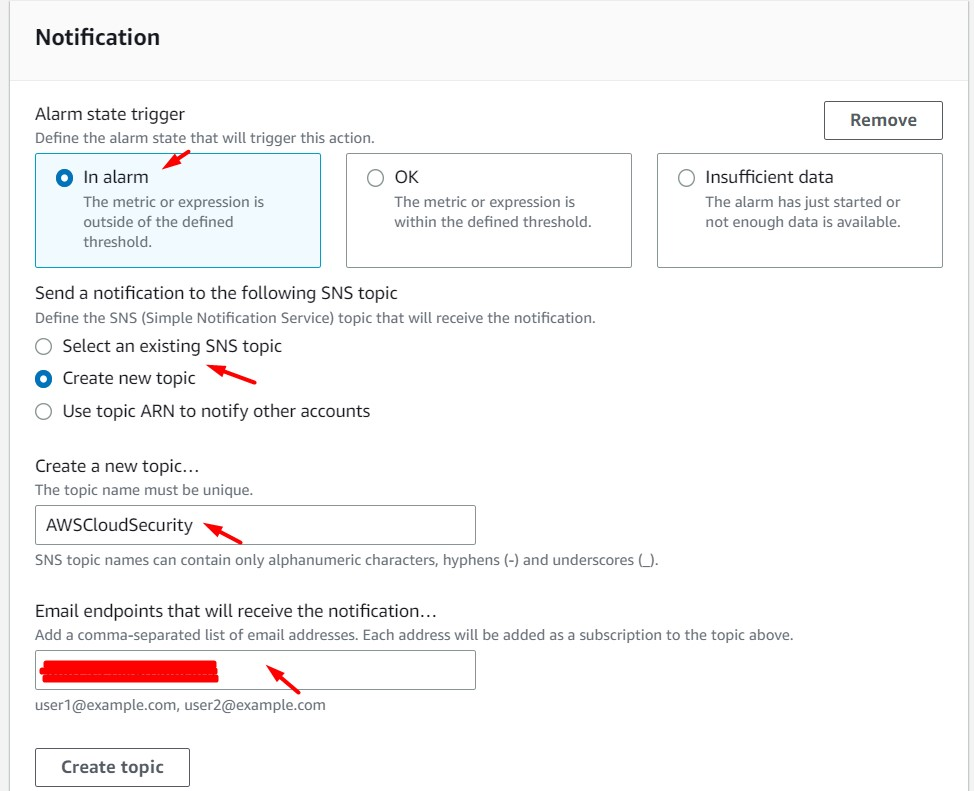
<br>

15. Dar clic en "Create Topic" y luego dar clic en "Next". Ingresamos un nombre a nuestra alarma (p.ej. AWSFailedAuthenticationAttempts) y damos clic en el botón "Next". Verificamos los valores ingresados y damos clic en "Create Alarm"

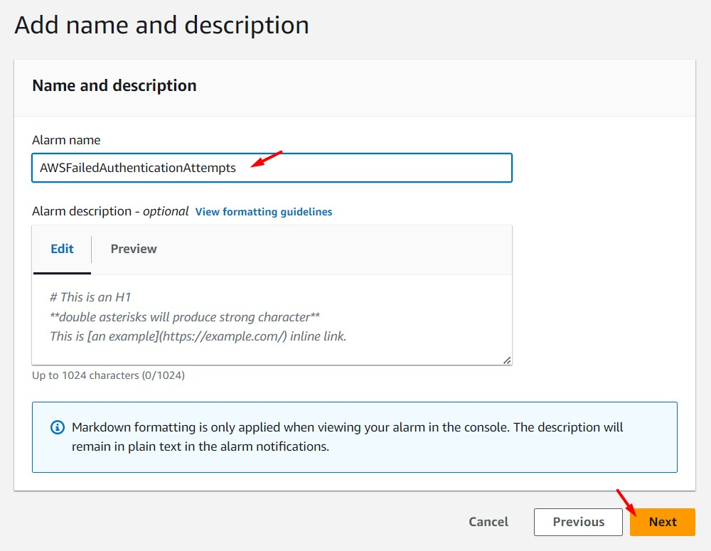
<br>

16. Al buzón del correo electrónico ingresado en el paso 14, habrá llegado un mensaje de confirmación (Subject: AWS Notification - Subscription Confirmation). Dar clic en el enlace "Confirm subscription". Nuestro correo electrónico estará correctamente validado.

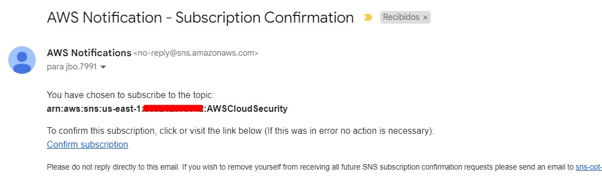
<br>


<br>

17. Desde un navegador en incógnito, ingresar a nuestra cuentas de AWS de forma fallida (contraseña o MFA incorrecto). Después de unos minutos la notificación habrá llegado a nuestro correo electrónico registrado en el paso 14.

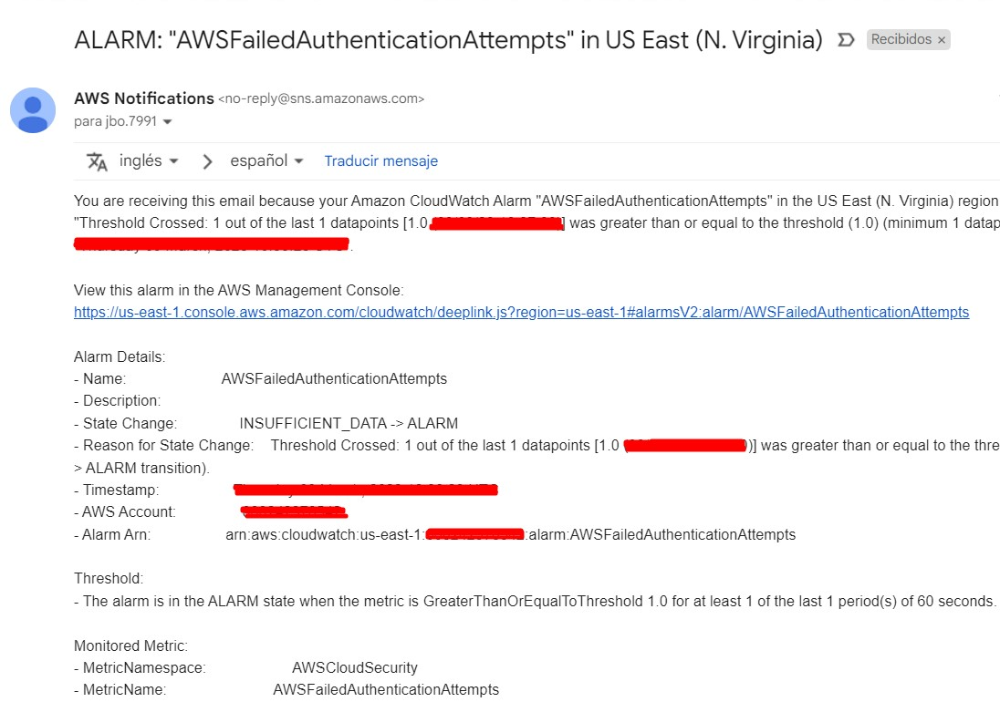
<br>


18. Diagrama de la solución

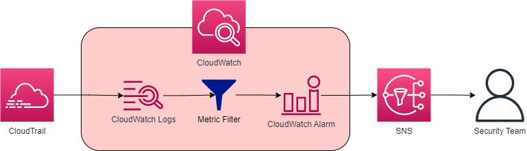
<br>

19. Se detalla a continuación más tipos de "Metric Filters" a ser usados

```bash
#CreateAndDeleteLoadBalancer
{($.eventName = CreateLoadBalancer) || ($.eventName = DeleteLoadBalancer)}

#AWSConsoleRootLoginAttempts
{ $.userIdentity.type = "Root" && $.userIdentity.invokedBy NOT EXISTS && $.eventType != "AwsServiceEvent"}

#IAMPolicyChanges
{($.eventName=DeleteGroupPolicy)||($.eventName=DeleteRolePolicy)||($.eventName=DeleteUserPolicy)||($.eventName=PutGroupPolicy)||($.eventName=PutRolePolicy)||($.eventName=PutUserPolicy)||($.eventName=CreatePolicy)||($.eventName=DeletePolicy)||($.eventName=CreatePolicyVersion)||($.eventName=DeletePolicyVersion)||($.eventName=AttachRolePolicy)||($.eventName=DetachRolePolicy)||($.eventName=AttachUserPolicy)||($.eventName=DetachUserPolicy)||($.eventName=AttachGroupPolicy)||($.eventName=DetachGroupPolicy)}

#S3BucketPolicyChanges
{ ($.eventSource = s3.amazonaws.com) && (($.eventName = PutBucketAcl) || ($.eventName = PutBucketPolicy) || ($.eventName = PutBucketCors) || ($.eventName = PutBucketLifecycle) || ($.eventName = PutBucketReplication) || ($.eventName = DeleteBucketPolicy) || ($.eventName = DeleteBucketCors) || ($.eventName = DeleteBucketLifecycle) || ($.eventName = DeleteBucketReplication)) }

#VPCConfigurationChanges
{ ($.eventName = CreateVpc) || ($.eventName = DeleteVpc) || ($.eventName = ModifyVpcAttribute) || ($.eventName = AcceptVpcPeeringConnection) || ($.eventName = CreateVpcPeeringConnection) || ($.eventName = DeleteVpcPeeringConnection) || ($.eventName = RejectVpcPeeringConnection) || ($.eventName = AttachClassicLinkVpc) || ($.eventName = DetachClassicLinkVpc) || ($.eventName = DisableVpcClassicLink) || ($.eventName = EnableVpcClassicLink) }
```

---

### Eliminación de recursos creados
<br>

1. Eliminar "Trail: security-trail" en CloudTrail
2. Eliminar "CloudWatch Logs Group: security-logs" en CloudWatch
3. Eliminar "Tópico SNS: AWSCloudSecurity"
4. Eliminar Bucket S3 "aws-cloudtrail-logs-*"
