# AWS Cloud Practitioner - Laboratorio 12

### Objetivo: 
* Creación de una VPC personalizada: VPC, Subnet, Route Table e Internet Gateway

---

### A - Creación de una VPC personalizada: VPC, Subnet, Route Table e Internet Gateway

 

1. Ingresar al servicio VPC, luego ingresamos a la opción "Your VPCs" y damos clic en el botón "Create VPC"

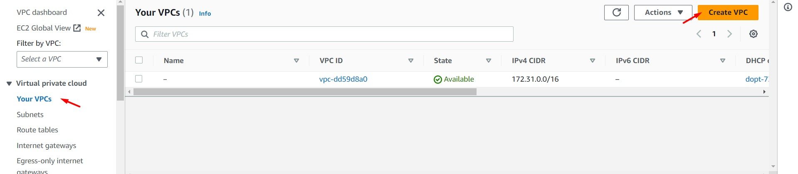
 

2.  Ingresamos/seleccionamos los siguientes valores. Finalmente dar clic en el botón "Create VPC"

    * Name tag - optional: PROD VPC
    * IPv4 CIDR: 10.0.0.0/16

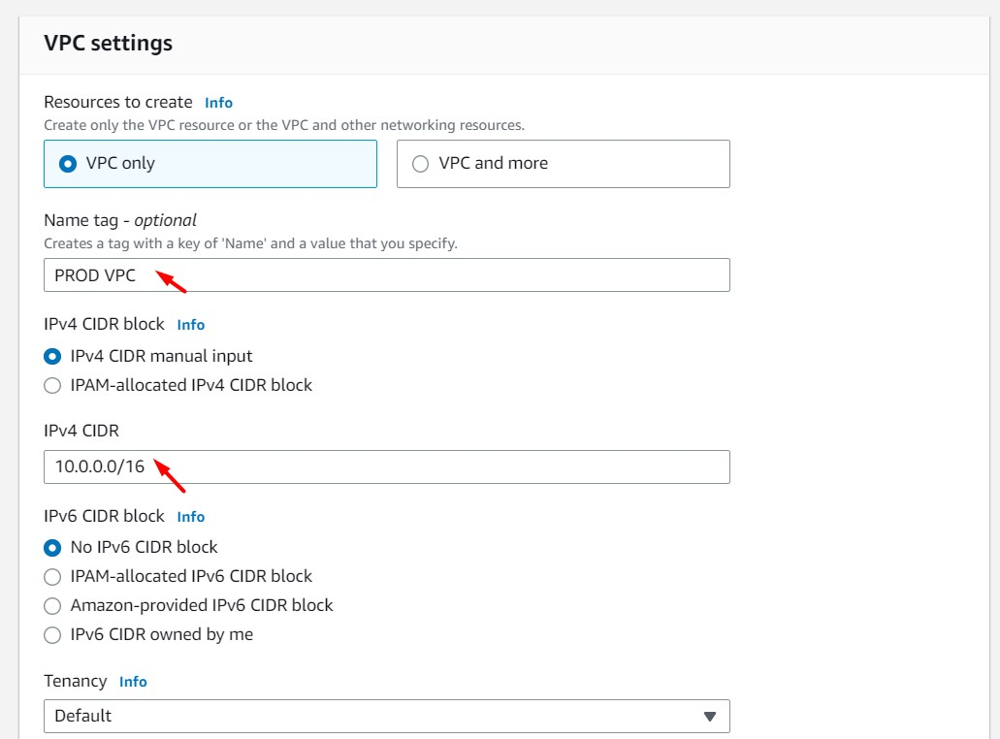
 

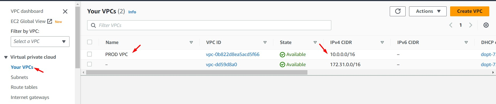
 

3. Ingresamos a la opción "Subnets", luego damos clic en el botón "Create subnet". Seleccionamos la VPC "PROD VPC" y agregamos 02 subnets públicas (uno ubicado en la AZ "A" y el otro en la AZ "B"). Ingresamos/seleccionamos los siguientes valores. Para agregar la segunda subnet debemos dar clic en el botón "Add Subnet". Al finalizar damos clic en el botón "Create subnet"

    **Subnet A**
    * Subnet Name: SUBNET PUBLICA AZ A
    * Availability Zone: us-east-1a
    * IPv4 CIDR block: 10.0.1.0/24

    **Subnet B**
    * Subnet Name: SUBNET PUBLICA AZ B
    * Availability Zone: us-east-1b
    * IPv4 CIDR block: 10.0.2.0/24

 

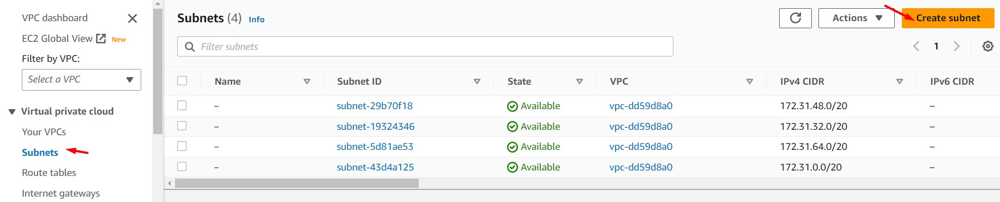
 

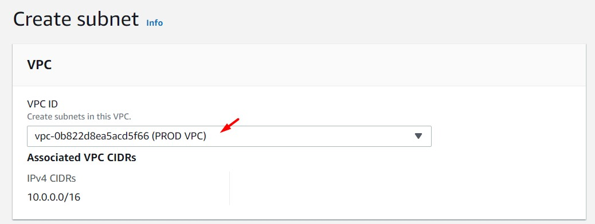
 

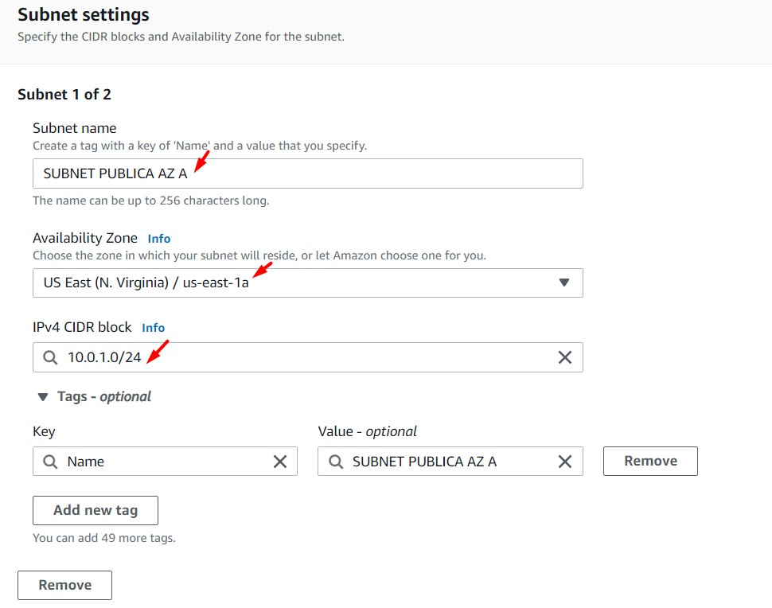
 

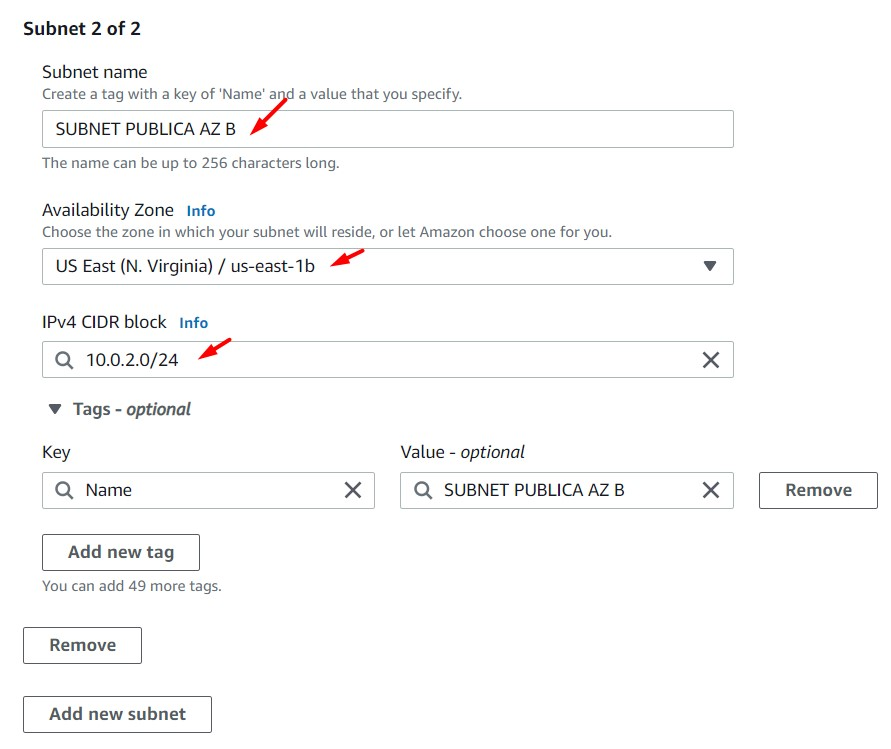
 

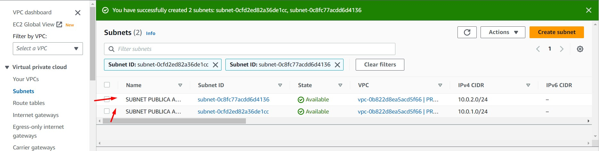
 

4. En ambas subnets públicas habilitar la opción "Enable auto-assign public IPv4 address". Clic derecho "Edit subnet settings" y luego dar clic en el check "Enable auto-assign public IPv4 address". Guardar los cambios

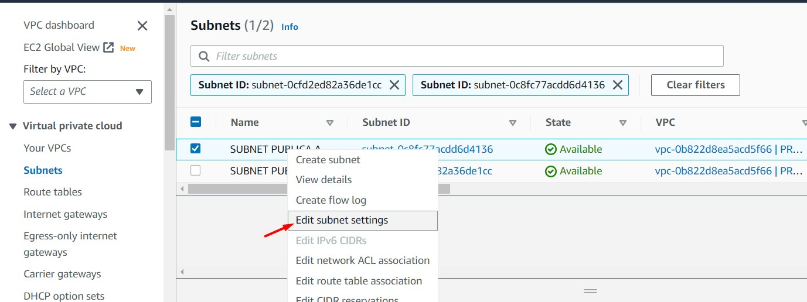
 

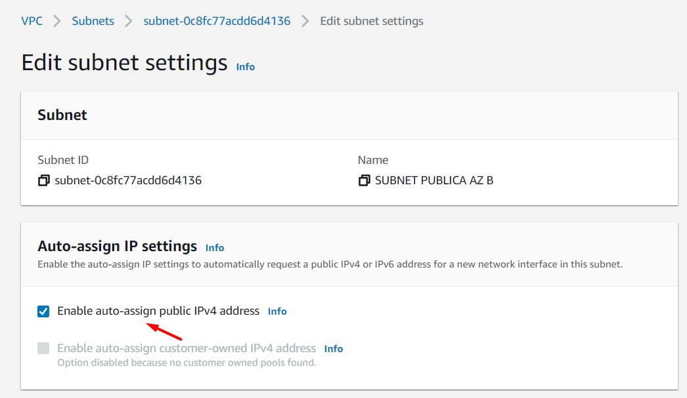
 

5. Ingresamos a la opción "Internet Gateway" y damos clic en el botón "Create Internet Gateway". Ingresamos el nombre "IG PROD" y damos clic en el botón "Create Internet Gateway"

 

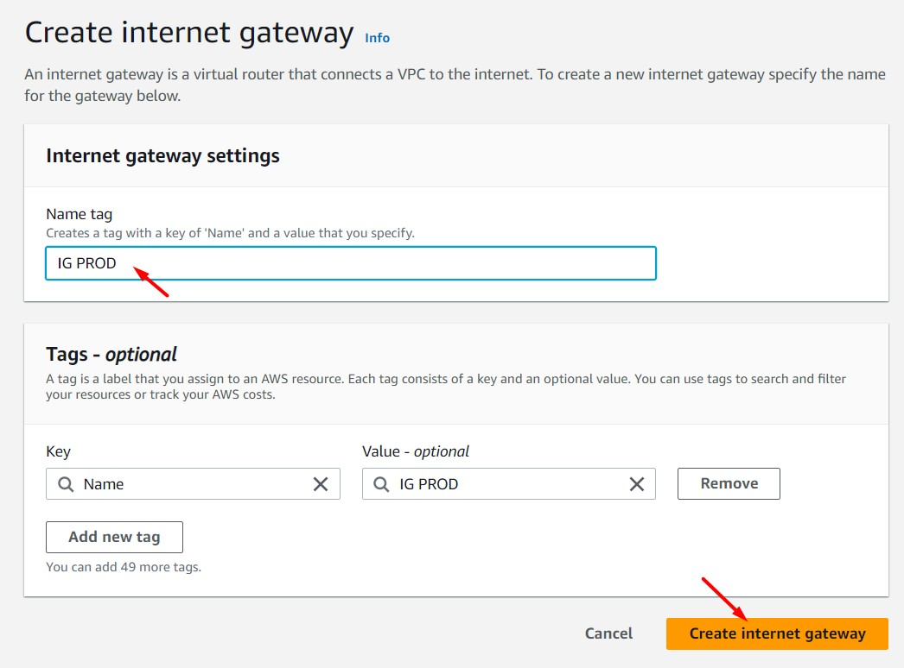
 

6. Desde la opción "Internet Gateway" seleccionar el Internet Gateway "IG PROD", dar clic en la opción "Actions" y seleccionar la opción "Attach to VPC". Seleccionar la VPC "PROD VPC" y guardar los cambios. Desde la opción "Internet Gateway" el estado cambiará a "Attached"

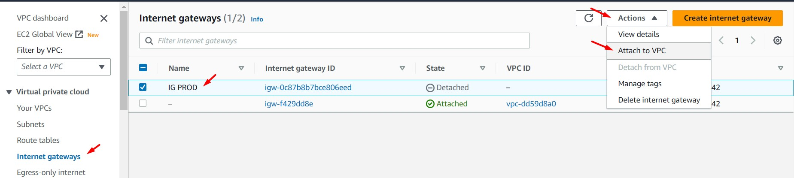
 

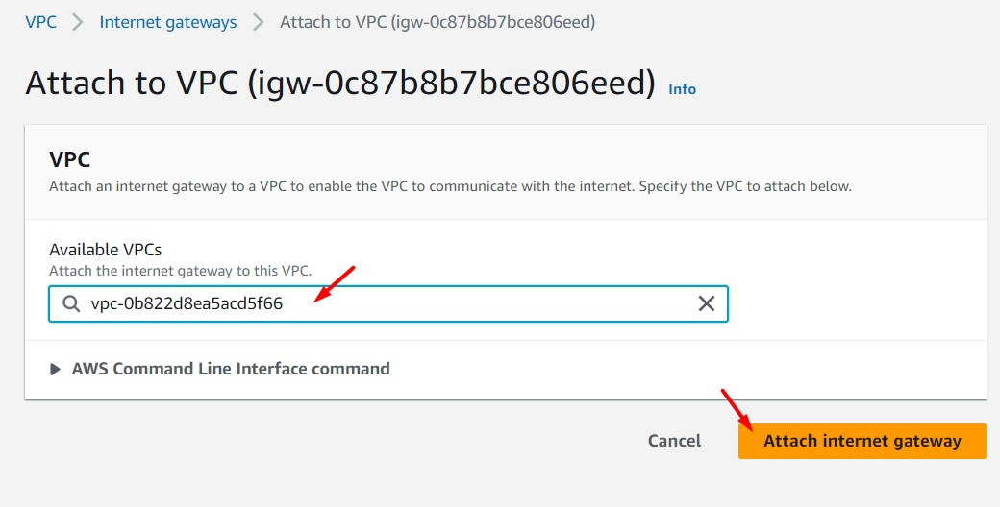
 

 

7. Ingresamos a la opción "Route Tables" e identificamos el route table que corresponde a la VPC creada, ver campo "VPC". Asignamos el nombre "PROD PUBLIC RT"

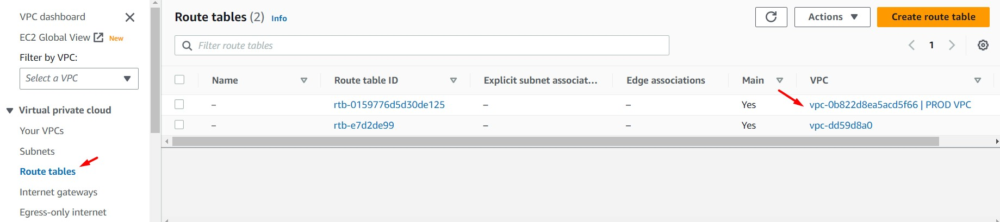
 

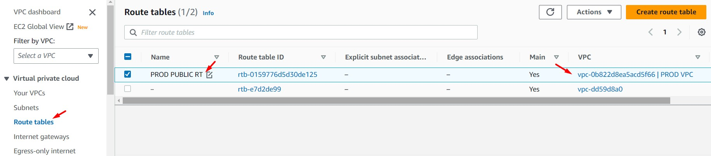
 

8. Damos clic sobre "PROD PUBLIC RT" y seleccionamos la opción "Routes". Dar clic en la opción "Edit routes". Clic en "Add route" y agregamos los siguientes valores. Guardar los cambios al finalizar.

    * Destination: 0.0.0.0/0
    * Target: Internet Gateway

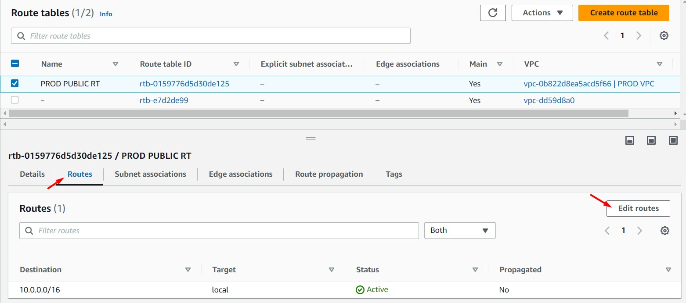
 

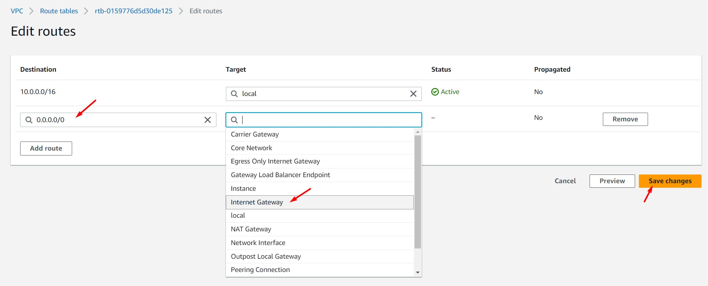
 

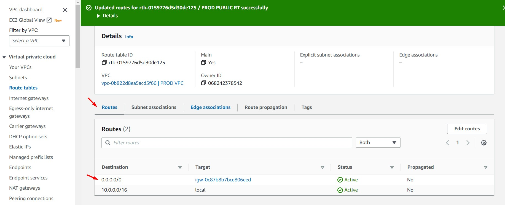
 

9. Dar clic en la opción "Subnet associations", en la sección "Explicit subnet associations" dar clic en "Edit subnet associations". Seleccionar las subnets que estarán asociadas al Route Table "PROD PUBLIC RT", para este caso las dos únicas subnets estarán asociadas al route table en mención. Guardar los cambios.

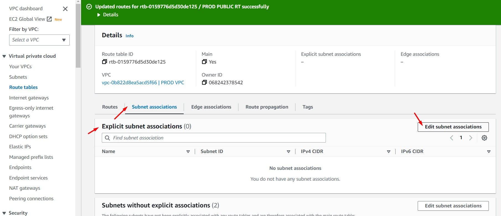
 

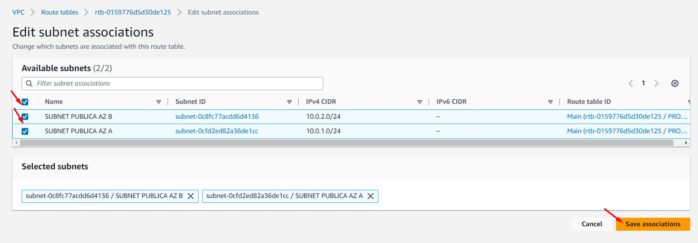
 

10. Para validar la conectividad en nuestra VPC personalizada deberemos aprovisionar una instancia EC2 en una de las subnets y poder conectarnos a ella. El Laboratorio 10 (Lab-10) explica el paso a paso para aprovisionar una instancia EC2. Durante el proceso de creación de la instancia modificar la sección "Network Settings" con los valores propios de la VPC creada en este laboratorio.

 

11. Diagrama de la solución

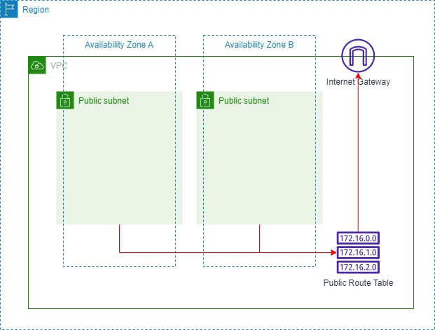
 

---

### Eliminación de recursos creados
 

1. Eliminar "VPC: PROD VPC". La eliminación de la VPC permite eliminar automáticamente otros recursos de red.
2. Si se ha aprovisionado algún recurso dentro de la "VPC: PROD VPC", eliminar primero el recurso aprovisionado y luego eliminar la VPC.